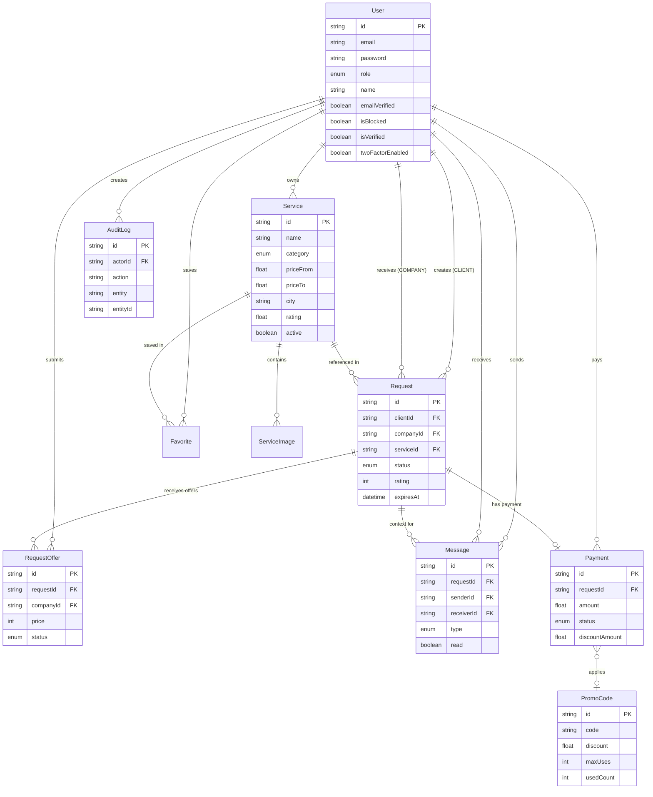
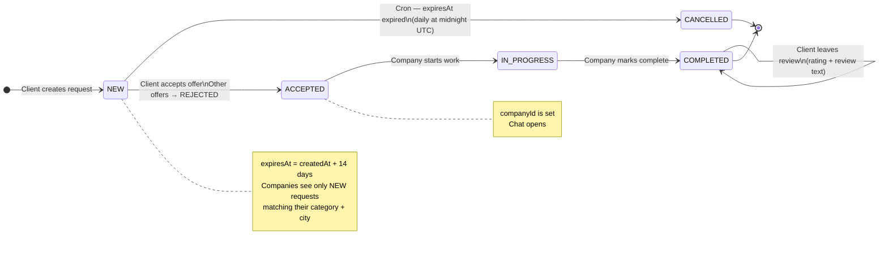
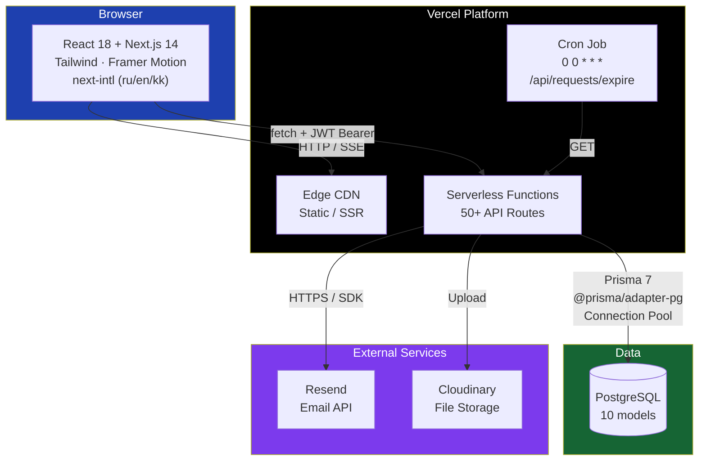
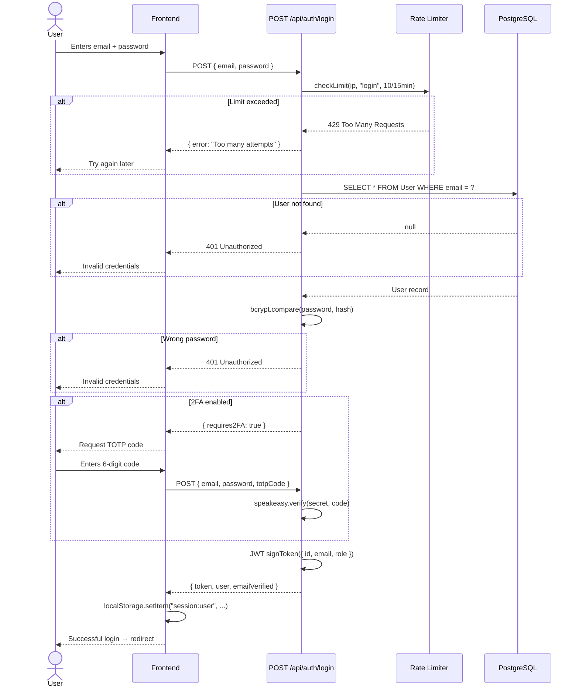
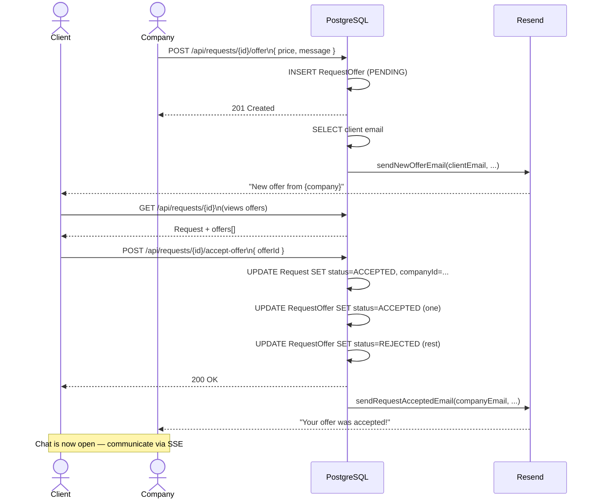
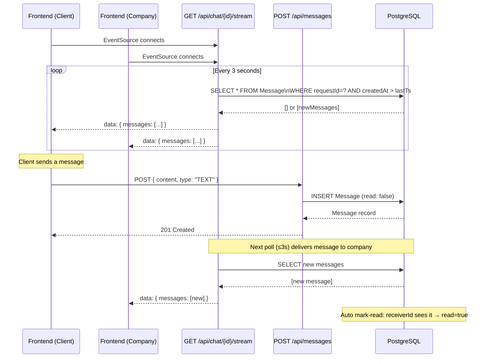
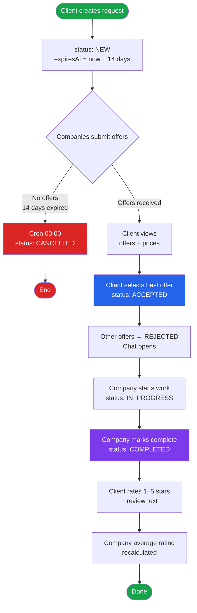
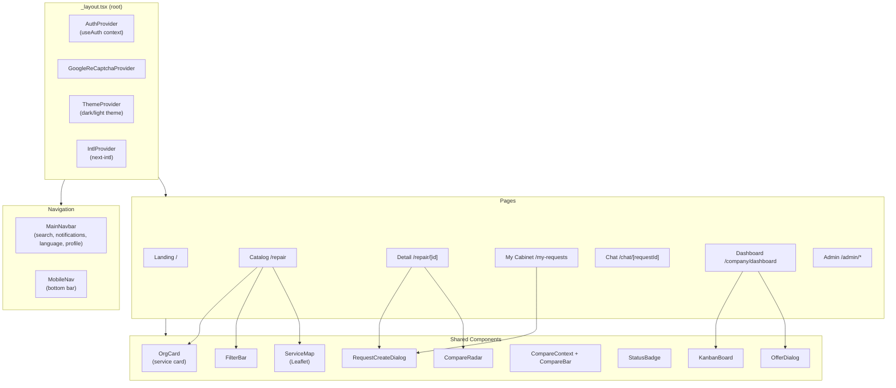
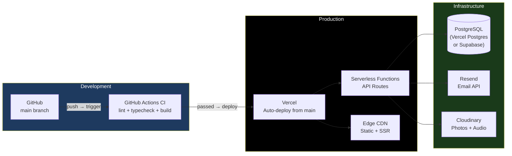
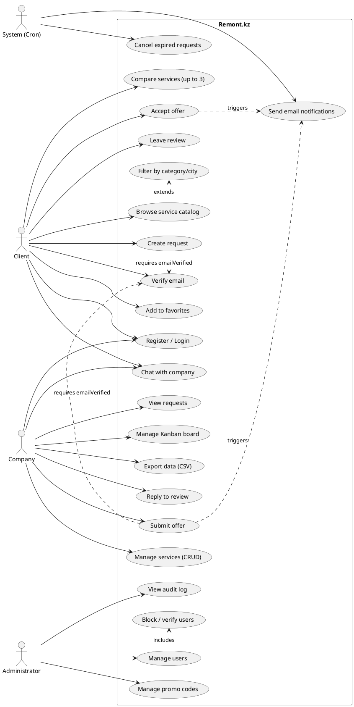

# Diploma Project — Remont.kz
## Repair Services Marketplace for Kazakhstan

---

## 1. PROJECT OVERVIEW

**Title:** Remont.kz — a web platform for searching and ordering repair and construction services in Kazakhstan

**Type:** Full-stack web application

**Year:** 2026

**Stack:** Next.js 14 · TypeScript · PostgreSQL · Prisma 7 · Tailwind CSS · shadcn/ui · Framer Motion · next-intl

**Repository:** https://github.com/Asanali2077/remont_kz

---

## 2. RELEVANCE

The repair and construction services market in Kazakhstan has several systemic problems:

- **Lack of transparency:** clients cannot access reliable reviews and contractor ratings
- **Information asymmetry:** finding contractors happens through word-of-mouth and messenger ads — inefficient and unreliable
- **No competitive pricing mechanism:** clients cannot compare offers from multiple companies on the same request
- **Language barrier:** most digital platforms are not adapted for Kazakh-speaking audiences
- **No status tracking:** no tools to track order progress

Remont.kz solves these problems by providing a unified digital marketplace with a tender-based request system, ratings, real-time chat, and a multilingual interface.

---

## 3. GOALS AND OBJECTIVES

### Goal
Develop a web platform that automates the process of searching, selecting, and interacting between clients and repair service providers in Kazakhstan.

### Objectives
1. Design a relational database for users, services, requests, and communications
2. Implement a JWT-based authentication system with email verification and two-factor authentication
3. Develop a tender-based request mechanism (client publishes → companies make offers → client selects)
4. Implement real-time chat between client and contractor
5. Build a rating and review system for objective company evaluation
6. Support multilingualism (Russian, Kazakh, English)
7. Develop an administrative panel for platform management
8. Set up CI/CD and containerization for production deployment

---

## 4. ANALYSIS OF EXISTING SOLUTIONS

| Platform | Country | Drawbacks for KZ |
|----------|---------|-----------------|
| Profi.ru | Russia | Russia-focused, no Kazakh language, no tenge |
| YouDo | Russia | No localization, not adapted to the Kazakh market |
| Kolesa.kz / Krisha.kz | KZ | Narrow specialization (cars / real estate), no repair services |
| WhatsApp ads | — | No ratings, no structure, no transaction security |

**Conclusion:** The Kazakh market lacks a universal repair services marketplace covering the full cycle — from publishing a request to rating the result.

---

## 5. TECHNOLOGY STACK AND RATIONALE

### 5.1 Frontend + Backend — Next.js 14 (App Router)

**Rationale:**
- Single codebase for client and server logic (monorepo)
- Server-Side Rendering (SSR) provides SEO optimization for the service catalog
- App Router with React Server Components reduces JS sent to the client
- API Routes in the same project eliminate the need for a separate backend server
- Wide ecosystem, active Vercel support

### 5.2 TypeScript

**Rationale:**
- Static typing catches errors at compile time
- Facilitates refactoring in a large codebase
- Autocomplete reduces typos in field names

### 5.3 PostgreSQL + Prisma 7

**Rationale:**
- PostgreSQL: reliable relational DBMS with JSONB, indexes, cascade deletion support
- Prisma: type-safe ORM with auto-generated client from schema, convenient migrations
- `@prisma/adapter-pg` — pool-based adapter instead of the default engine: critical for Vercel Serverless Functions where each invocation creates a new Node.js process; the pool reuses connections

### 5.4 Tailwind CSS + shadcn/ui

**Rationale:**
- Utility-first CSS: no name conflicts, easy style overrides
- shadcn/ui — components are copied into the project (not a dependency), so they are easily customized
- Radix UI under shadcn ensures accessibility (ARIA)

### 5.5 Framer Motion

**Rationale:**
- Declarative animations (not CSS keyframes): animation logic in JSX alongside the component
- `AnimatePresence` support for mount/unmount animations
- Used on the landing page, about page, and modal transitions

### 5.6 next-intl

**Rationale:**
- Built-in App Router support (not the deprecated pages router)
- Locale routing via `app/[locale]/` — each page is available in 3 languages
- ICU message format for correct number inflection

### 5.7 JWT + bcrypt (stateless authentication)

**Rationale:**
- Stateless: the server does not need to store sessions, compatible with serverless deployment
- bcrypt with 12 salt rounds — industry standard for password storage
- Token in `localStorage` checked on every API request via `Authorization: Bearer`

### 5.8 Resend (Email)

**Rationale:**
- HTTP SDK instead of SMTP — SMTP uses TCP connections blocked in Vercel Serverless Functions; Resend works over HTTPS
- Reliable delivery, webhook confirmations, built-in analytics

### 5.9 Server-Sent Events (SSE) for Chat

**Rationale:**
- WebSockets require persistent connections, incompatible with Vercel Serverless
- SSE works over a regular HTTP GET; Vercel supports streaming responses
- One-directional channel (server → client) is sufficient: the client sends via REST POST

### 5.10 speakeasy + qrcode (Two-Factor Authentication)

**Rationale:**
- TOTP (RFC 6238) is the industry standard for 2FA — compatible with Google Authenticator, Authy
- QR code generated server-side in base64, sent to client for scanning
- Secret stored per-user in the database

### 5.11 Leaflet + react-leaflet (Map View)

**Rationale:**
- Open-source interactive maps — no API key required for basic tile display
- Allows displaying service locations in the catalog with geographic coordinates
- `ServiceMap.tsx` component renders pins for services with lat/lng

### 5.12 Recharts (Charts)

**Rationale:**
- Composable React charting library built on D3
- Used in the company dashboard: revenue bar charts, category pie charts, overview trend lines

### 5.13 Web Push (PWA Notifications)

**Rationale:**
- `web-push` package enables browser push notifications without the app being open
- `PWAInstallPrompt.tsx` invites users to install the app to their home screen
- Works alongside the in-app notification polling for maximum reach

### 5.14 reCAPTCHA v3

**Rationale:**
- Protection of registration and login forms from bot attacks without UI interruption (v3 — invisible)
- Server-side token verification in `lib/recaptcha.ts`
- Infrastructure is ready; rate limiting is the active bot protection

---

## 6. SYSTEM ARCHITECTURE

### 6.1 Overview

```
┌─────────────────────────────────────────────────┐
│               CLIENT (Browser)                  │
│  React 18 + Next.js 14 App Router               │
│  Tailwind CSS, shadcn/ui, Framer Motion         │
│  next-intl (ru / en / kk)                       │
└──────────────────────┬──────────────────────────┘
                       │ HTTP / SSE
┌──────────────────────▼──────────────────────────┐
│           NEXT.JS SERVER (API Routes)           │
│  /api/* — 50+ routes                            │
│  JWT middleware (lib/middleware.ts)             │
│  Zod validation, rate limiting                  │
│  Email: Resend SDK   Push: web-push             │
│  File uploads: Cloudinary / local disk          │
└──────────────────────┬──────────────────────────┘
                       │ Prisma 7 + @prisma/adapter-pg
┌──────────────────────▼──────────────────────────┐
│              PostgreSQL                         │
│  10 models, indexes, cascade deletion           │
└─────────────────────────────────────────────────┘
```

### 6.2 Directory Structure

```
remont_kz/
├── app/
│   ├── [locale]/              # All pages with i18n routing
│   │   ├── page.tsx           # Landing page
│   │   ├── repair/            # Service catalog + detail page
│   │   ├── company/           # Profile, dashboard, catalog, report
│   │   ├── companies/         # Company directory
│   │   ├── my-requests/       # Client personal cabinet (tab-based)
│   │   ├── my-payments/       # Client payment history
│   │   ├── chat/              # Chat inbox + thread
│   │   ├── compare/           # Service comparison
│   │   ├── order-summary/[id] # Order summary view
│   │   ├── billing/           # Billing (companies only)
│   │   ├── guide/             # FAQ / Help center
│   │   ├── about/             # About the project
│   │   ├── admin/             # Admin panel (split into sub-pages)
│   │   └── payment/           # Payment flow (companies only)
│   └── api/                   # 50+ API routes
├── components/
│   ├── auth/                  # AuthProvider, AuthModal
│   ├── company/               # Kanban, statistics, calendar, onboarding
│   ├── admin/                 # Sidebar, tables, dialogs
│   ├── filters/               # FilterBar, CategoryFilter
│   ├── nav/                   # MainNavbar
│   ├── payment/               # PaymentStatusBadge
│   └── ui/                    # shadcn/ui base components
├── lib/                       # Utilities and singletons
│   ├── api.ts                 # API client singleton
│   ├── auth.ts                # JWT + bcrypt
│   ├── audit.ts               # Audit log helpers
│   ├── categories.ts          # Category hierarchy
│   ├── cities.ts              # Kazakhstan cities list
│   ├── db.ts                  # Prisma singleton (globalThis cache)
│   ├── email.ts               # Email templates (6 types)
│   ├── geocode.ts             # Geocoding helpers
│   ├── middleware.ts          # Route guards
│   ├── rate-limit.ts          # In-memory rate limiter
│   ├── recaptcha.ts           # reCAPTCHA v3 server verification
│   ├── typing-store.ts        # Chat typing indicator store
│   ├── types.ts               # Frontend TypeScript types
│   ├── upload.ts              # File upload (magic-byte validation)
│   ├── use-notifications.ts   # Notification polling hook
│   └── utils.ts               # cn(), fmtNum(), timeAgo(), sanitizeText()
├── prisma/
│   ├── schema.prisma          # 10 DB models
│   └── seed.ts                # Demo data
├── messages/                  # i18n: ru.json, en.json, kk.json (~650 keys each)
├── i18n/                      # next-intl configuration
├── public/                    # Static assets (images, icons, slides)
├── vercel.json                # Cron jobs
├── Dockerfile                 # Multi-stage container build
└── .github/workflows/ci.yml   # CI/CD pipeline
```

### 6.3 User Roles

| Role | Description | Available Features |
|------|-------------|-------------------|
| `CLIENT` | Customer | Publish requests, select offers, chat, ratings, favorites |
| `COMPANY` | Contractor | Manage services, submit offers, Kanban, export, billing |
| `ADMIN` | Administrator | User management, moderation, audit log, promo codes |

---

## 7. DATABASE SCHEMA

### 7.1 Entity Relationship Diagram (abbreviated)

```
User ──< Service ──< ServiceImage
 │           │
 │           └──< Favorite
 │
 ├──< Request (as client) ──< RequestOffer ──< User (as company)
 │        │
 │        ├──< Message
 │        └── Payment ──> PromoCode
 │
 ├──< AuditLog
 └──< Payment
```

### 7.2 All 10 Models

#### User
Central model. Combines clients, companies, and administrators.

| Field | Type | Description |
|-------|------|-------------|
| `id` | UUID | Primary key |
| `email` | String @unique | Login |
| `password` | String | bcrypt hash (12 rounds) |
| `role` | UserRole | CLIENT / COMPANY / ADMIN |
| `name` | String? | Name / company name |
| `phone` | String? | Phone number |
| `avatarUrl` | String? | Avatar URL |
| `address` | String? | Address |
| `description` | Text? | Company description |
| `lastActiveAt` | DateTime? | Last activity timestamp |
| `emailVerified` | Boolean | Whether email is confirmed |
| `emailVerifyToken` | String? @unique | Email verification token |
| `resetToken` | String? @unique | Password reset token |
| `resetTokenExpiresAt` | DateTime? | Reset token expiry |
| `isBlocked` | Boolean | Whether user is blocked |
| `blockReason` | String? | Reason for block |
| `isVerified` | Boolean | Whether company is admin-verified |
| `twoFactorSecret` | String? | TOTP secret for 2FA |
| `twoFactorEnabled` | Boolean | Whether 2FA is enabled |

**Indexes:** `email`, `role`

#### Service
A company's service listing.

| Field | Type | Description |
|-------|------|-------------|
| `id` | UUID | Primary key |
| `name` | String | Service name |
| `category` | ServiceCategory | Category (10 values) |
| `description` | Text | Description |
| `priceFrom` | Float | Price from (tenge) |
| `priceTo` | Float | Price to (tenge) |
| `active` | Boolean | Show in catalog |
| `city` | String? | City |
| `rating` | Float? | Average rating (computed) |
| `licensed` | Boolean | Has a license |
| `tags` | String[] | Search tags |
| `customAttributes` | Json? | Flexible key-value pairs |
| `address` | String? | Address |
| `lat` / `lng` | Float? | Coordinates for map |
| `startDate` / `endDate` | DateTime? | Service availability window |
| `schedule` | String? | Working schedule description |
| `companyId` | FK → User | Owner |

**Indexes:** `companyId`, `category`, `city`, `active`

#### ServiceImage
Up to 10 images per service with sort order.

#### Request
A client's job request.

| Field | Type | Description |
|-------|------|-------------|
| `id` | UUID | Primary key |
| `clientId` | FK → User | Customer |
| `serviceId` | FK → Service? | Linked to a specific service (optional) |
| `companyId` | FK → User? | Assigned company (after offer accepted) |
| `description` | Text | Problem description |
| `category` | ServiceCategory? | Category |
| `city` | String? | City |
| `imageUrl` | String? | Attached photo |
| `status` | RequestStatus | NEW / ACCEPTED / IN_PROGRESS / COMPLETED / CANCELLED |
| `rating` | Int? | Client rating (1–5) |
| `review` | Text? | Review text |
| `companyReply` | Text? | Company reply to review |
| `budgetFrom` / `budgetTo` | Float? | Expected budget range |
| `finalPrice` | Int? | Final agreed price |
| `viewCount` | Int | Number of views |
| `expiresAt` | DateTime? | Request expiry (14 days) |
| `deadline` | DateTime? | Desired completion date |

**Indexes:** `clientId`, `companyId`, `serviceId`, `status`, `category`, `city`, `expiresAt`, composite `(category, city, status)`

#### RequestOffer
A company's bid on a client request.

| Field | Type | Description |
|-------|------|-------------|
| `requestId` | FK → Request | The request |
| `companyId` | FK → User | The company |
| `price` | Int | Offered price (tenge) |
| `message` | String? | Cover message |
| `status` | OfferStatus | PENDING / ACCEPTED / REJECTED |

**Constraint:** `@@unique([requestId, companyId])` — one company can submit one offer per request.

#### Message
A chat message (linked to a request).

| Field | Type | Description |
|-------|------|-------------|
| `requestId` | FK → Request? | Conversation context |
| `senderId` | FK → User | Sender |
| `receiverId` | FK → User | Recipient |
| `content` | Text | Text or description |
| `type` | MessageType | TEXT / IMAGE / AUDIO |
| `imageUrl` | String? | Image URL |
| `audioUrl` | String? | Voice message URL |
| `read` | Boolean | Whether it has been read |

#### Favorite
Client's saved services. `@@unique([userId, serviceId])` — no duplicates.

#### Payment
Payment linked to a request. Supports promo codes and Kaspi.

| Field | Type | Description |
|-------|------|-------------|
| `requestId` | FK → Request @unique | One payment per request |
| `clientId` | FK → User | Payer |
| `amount` | Float | Amount |
| `status` | PaymentStatus | PENDING / PAID / FAILED / REFUNDED |
| `method` | String | card / kaspi |
| `discountAmount` | Float | Promo code discount |
| `promoCodeId` | FK → PromoCode? | Applied promo code |
| `kaspiOrderId` | String? | Kaspi Pay order ID |
| `paidAt` | DateTime? | Payment timestamp |

#### AuditLog
Administrator action journal.

| Field | Type | Description |
|-------|------|-------------|
| `actorId` | FK → User | Who performed the action |
| `action` | String | Action code (USER_BLOCKED, SERVICE_DELETED…) |
| `entity` | String | Entity type |
| `entityId` | String | Entity ID |
| `metadata` | Json? | Additional data |

#### PromoCode
Discount codes with percentage values.

| Field | Type | Description |
|-------|------|-------------|
| `code` | String @unique | The code |
| `discount` | Float | Discount 0–100% |
| `maxUses` | Int? | Maximum uses (null = unlimited) |
| `usedCount` | Int | Current usage count |
| `expiresAt` | DateTime? | Expiry date |
| `isActive` | Boolean | Whether active |

### 7.3 Enumerations

```
UserRole:        CLIENT | COMPANY | ADMIN
ServiceCategory: AUTOMOBILES | REAL_ESTATE | PLUMBING | ELECTRICAL |
                 PAINTING | CLEANING | RENOVATION | WELDING | ROOFING | OTHER
OfferStatus:     PENDING | ACCEPTED | REJECTED
RequestStatus:   NEW | ACCEPTED | IN_PROGRESS | COMPLETED | CANCELLED
MessageType:     TEXT | IMAGE | AUDIO
PaymentStatus:   PENDING | PAID | FAILED | REFUNDED
```

---

## 8. REQUEST LIFECYCLE

```
1. Client publishes a request (status: NEW)
   → Request lives for 14 days (expiresAt = createdAt + 14 days)
   → Cron job marks expired NEW requests as CANCELLED daily at midnight UTC

2. Companies see requests matching their category and city
   → Company submits an offer (RequestOffer, status: PENDING)
   → Client receives email notification about the new offer

3. Client selects the best offer (request status: ACCEPTED)
   → Accepted offer → ACCEPTED
   → All other offers → REJECTED
   → Company receives email notification
   → Chat opens between client and company

4. Company progresses through statuses:
   ACCEPTED → IN_PROGRESS → COMPLETED

5. Client leaves a rating (1–5 stars) + review text
   → Company's average rating is recalculated across all its services
   → Company can reply to the review (companyReply)
```

---

## 9. ALL PAGES

| URL | File | Notes |
|-----|------|-------|
| `/` | `page.tsx` | Landing page with before/after slider, stats, categories, how-it-works, reviews |
| `/repair` | `repair/page.tsx` | Service catalog with filters, search, grid/list/map view |
| `/repair/[id]` | `repair/[id]/page.tsx` | Service detail, gallery, reviews, similar services |
| `/companies` | `companies/page.tsx` | Company directory |
| `/company/[id]` | `company/[id]/page.tsx` | Company public profile |
| `/company/dashboard` | `company/dashboard/page.tsx` | Company dashboard (Kanban, stats, services) |
| `/company/catalog` | `company/catalog/page.tsx` | Company service catalog view |
| `/company/report` | `company/report/page.tsx` | Printable company performance report |
| `/my-requests` | `my-requests/page.tsx` | Client personal cabinet (tab-based routing) |
| `/my-payments` | `my-payments/page.tsx` | Client payment history |
| `/chat` | `chat/page.tsx` | Chat inbox |
| `/chat/[requestId]` | `chat/[requestId]/page.tsx` | Chat thread with SSE |
| `/compare` | `compare/page.tsx` | Side-by-side service comparison (up to 3) |
| `/order-summary/[id]` | `order-summary/[id]/page.tsx` | Completed order summary |
| `/billing` | `billing/page.tsx` | Billing / plans (companies only) |
| `/guide` | `guide/page.tsx` | FAQ / Help center |
| `/about` | `about/page.tsx` | About page with architecture diagram |
| `/verify-email` | `verify-email/page.tsx` | Email verification result |
| `/forgot-password` | `forgot-password/page.tsx` | Password reset request |
| `/reset-password` | `reset-password/page.tsx` | Set new password |
| `/payment/[requestId]` | `payment/[requestId]/page.tsx` | Payment flow (companies only) |
| `/admin` | `admin/page.tsx` | Admin panel overview |
| `/admin/dashboard` | `admin/dashboard/page.tsx` | Admin statistics dashboard |
| `/admin/users` | `admin/users/page.tsx` | User management |
| `/admin/services` | `admin/services/page.tsx` | Service moderation |
| `/admin/requests` | `admin/requests/page.tsx` | All platform requests |
| `/admin/promo` | `admin/promo/page.tsx` | Promo code management |
| `/admin/audit` | `admin/audit/page.tsx` | Audit log |

### Client Personal Cabinet — Tab Structure (`/my-requests`)

The client cabinet uses a single-page tab-based layout via `ClientSidebar`:

| Tab | Description |
|-----|-------------|
| `requests` | My Requests — list with offers, timeline, acceptance |
| `messages` | Chat inbox |
| `favorites` | Saved services |
| `notifications` | Activity notifications |
| `history` | Order history |
| `profile` | Edit profile (name, phone, address, avatar) |
| `settings` | Security settings (password, 2FA) |

---

## 10. API ROUTES (complete list)

### Authentication
| Route | Method | Auth | Description |
|-------|--------|------|-------------|
| `/api/auth/register` | POST | — | Register (Zod, reCAPTCHA, rate-limit 5/hr) |
| `/api/auth/login` | POST | — | Login (rate-limit 10/15min), returns emailVerified |
| `/api/auth/me` | GET / DELETE | Any | Current user / delete account (password confirm) |
| `/api/auth/profile` | GET / PUT | Any | View/update profile |
| `/api/auth/password` | PUT | Any | Change password |
| `/api/auth/verify-email` | GET | — | Email verification via token |
| `/api/auth/forgot-password` | POST | — | Send reset email |
| `/api/auth/reset-password` | POST | — | Set new password (token required) |
| `/api/auth/2fa` | GET / POST / DELETE | Any | Manage two-factor authentication |

### Services
| Route | Method | Auth | Description |
|-------|--------|------|-------------|
| `/api/services` | GET / POST | POST=Company | List/create services |
| `/api/services/[id]` | GET / PUT / DELETE | PUT/DELETE=Company | Service CRUD |
| `/api/services/[id]/reviews` | GET | — | Service reviews |
| `/api/services/[id]/similar` | GET | — | Similar services |
| `/api/services/[id]/images` | GET / POST | POST=Company | Manage service images |
| `/api/services/[id]/images/[imageId]` | DELETE | Company | Delete service image |

### Requests
| Route | Method | Auth | Description |
|-------|--------|------|-------------|
| `/api/requests` | GET / POST | POST=Client | List/create requests |
| `/api/requests/[id]` | GET / PUT / DELETE | — | Request detail/update/cancel |
| `/api/requests/[id]/offer` | POST / DELETE | Company | Submit/withdraw offer |
| `/api/requests/[id]/accept-offer` | POST | Client | Accept company offer |
| `/api/requests/[id]/rate` | POST | Client | Rate completed request (1–5 stars) |
| `/api/requests/[id]/reply` | PUT | Company | Reply to review |
| `/api/requests/expire` | GET | — | Mark expired requests (Vercel cron) |

### Chat & Messages
| Route | Method | Auth | Description |
|-------|--------|------|-------------|
| `/api/messages` | GET / POST | Any | Chat messages |
| `/api/messages/upload` | POST | Any | Upload image/audio for chat |
| `/api/messages/mark-read` | POST | Any | Mark messages as read |
| `/api/chat` | GET | Any | Chat inbox list |
| `/api/chat/[requestId]/stream` | GET | Any | SSE real-time chat (3s polling) |
| `/api/chat/[requestId]/typing` | POST | Any | Typing indicator |

### Companies & Statistics
| Route | Method | Auth | Description |
|-------|--------|------|-------------|
| `/api/companies` | GET | — | List all companies |
| `/api/company/[id]` | GET | — | Company public profile |
| `/api/company/stats` | GET | Company | Dashboard statistics |
| `/api/company/export` | GET | Company | CSV export |
| `/api/stats` | GET | — | Platform-wide statistics |

### Misc
| Route | Method | Auth | Description |
|-------|--------|------|-------------|
| `/api/favorites` | GET / POST | Client | List/add favorites |
| `/api/favorites/[serviceId]` | DELETE | Client | Remove favorite |
| `/api/notifications/count` | GET | Any | Unread notification count |
| `/api/payments/[requestId]` | GET / POST | Any | Get/create payment |
| `/api/payments/[requestId]/confirm` | POST | Any | Confirm payment |
| `/api/promo/validate` | POST | Client | Validate promo code |
| `/api/health` | GET | — | DB health check |
| `/api/files/[...path]` | GET | — | Serve uploaded files |

### Admin (`/api/admin/*`)
| Route | Method | Description |
|-------|--------|-------------|
| `/api/admin/users` | GET | List all users |
| `/api/admin/users/[id]` | GET / PUT / DELETE | User management (block, verify) |
| `/api/admin/services` | GET | All services |
| `/api/admin/services/[id]` | DELETE | Delete service |
| `/api/admin/requests` | GET | All requests |
| `/api/admin/audit` | GET | Audit log |
| `/api/admin/stats` | GET | Summary statistics |
| `/api/admin/promo` | GET / POST | Promo code management |
| `/api/admin/promo/[id]` | PUT / DELETE | Edit promo code |

---

## 11. AUTHENTICATION AND SECURITY

### 11.1 JWT (JSON Web Token)

- Signing algorithm: HS256
- Token expiry: 7 days
- Stored in `localStorage` under the key `session:user` as `{ token, id, email, role, name, phone }`
- Sent via `Authorization: Bearer <token>` header
- `lib/auth.ts`: functions `signToken()`, `verifyToken()`, `hashPassword()`, `verifyPassword()`

### 11.2 Route Guards (`lib/middleware.ts`)

```typescript
requireAuth()          // any authenticated user
requireClient()        // CLIENT role only
requireCompany()       // COMPANY role only
requireAdmin()         // ADMIN role only
assertEmailVerified()  // email must be verified
```

### 11.3 Email Verification

1. On registration a unique `emailVerifyToken` (UUID) is generated
2. Link `{BASE_URL}/verify-email?token=...` is sent via Resend
3. On link click: token is looked up in DB, `emailVerified` is set to `true`, token is cleared
4. Service creation and offer submission require `emailVerified = true`

### 11.4 Two-Factor Authentication (2FA)

- TOTP (Time-based One-Time Password) per RFC 6238
- Library: `speakeasy`
- Secret generated server-side; QR code returned as base64 for scanning (Google Authenticator, Authy)
- Once 2FA is enabled: login requires a 6-digit code alongside the password
- Secret stored in `twoFactorSecret` field in DB

### 11.5 Password Reset

1. Client requests reset → `resetToken` (UUID) is generated with 1-hour expiry
2. Link is sent to email
3. Client opens link, enters new password
4. Server checks token and expiry → updates password hash, clears token

### 11.6 Rate Limiting

- In-memory (`Map`) in `lib/rate-limit.ts`
- Registration: 5 requests/hour per IP
- Login: 10 requests/15 minutes per IP
- Cleanup: automatically every 5 minutes

### 11.7 Input Validation (Zod)

- All incoming API route data is validated with Zod schemas
- Example: registration schema checks email, password (min 8 chars + 1 digit), name

### 11.8 XSS Protection

- `sanitizeText()` in `lib/utils.ts` strips HTML tags from all user input
- Called before saving descriptions, reviews, and messages to DB

### 11.9 reCAPTCHA v3 (infrastructure ready, not wired)

- Server-side verifier implemented in `lib/recaptcha.ts`
- Library `react-google-recaptcha-v3` present in `package.json`
- **Not integrated:** neither `AuthModal` nor `/auth/register` and `/auth/login` API routes call reCAPTCHA
- Bot protection is provided by rate limiting (`lib/rate-limit.ts`)

---

## 12. FEATURES BY ROLE

### 12.1 Client (CLIENT)

**Personal Cabinet (`/my-requests`) — tab-based layout**

The client accesses all account features through a single page with a sidebar (desktop) or tab navigation (mobile). Tabs:

- **My Requests** — list of all requests with status filter, status timeline for each request, list of received offers with prices, offer acceptance button, link to chat
- **Chat** — active conversations with last message and unread count, real-time updates via SSE
- **Favorites** — saved services with quick access to detail or request creation
- **Notifications** — new offers, status changes, new messages
- **Order History** — completed and cancelled requests with reviews
- **Profile** — edit name, phone, address, avatar
- **Settings** — change password (requires current), manage 2FA (QR code + verification)

**Service Catalog (`/repair`)**
- Filter by category (10), city, price range (range slider), rating, tags
- View modes: grid / list / map (Leaflet)
- Search by name and description (300ms debounce)
- Sort by rating, price, date

**Service Detail (`/repair/[id]`)**
- Image gallery
- Ratings and reviews with pagination
- Similar services
- "Submit Request" button → request creation dialog
- Add to favorites / comparison

**Service Comparison (`/compare`)**
- Up to 3 services simultaneously
- Compare: price, rating, category, city, description
- Radar chart comparison (`CompareRadar`)

### 12.2 Company (COMPANY)

**Dashboard (`/company/dashboard`)**
- Kanban board: NEW / ACCEPTED / IN_PROGRESS / COMPLETED
- Drag-and-drop cards to change status
- Statistics: revenue, request counts by status, rating, new clients
- Charts (Recharts): revenue bar chart, category pie chart, trend line
- Calendar view (`CompanyCalendar`) showing scheduled work
- Onboarding checklist for new companies (`OnboardingChecklist`)

**Service Management**
- CRUD: create, edit, delete services
- Upload up to 10 images per service
- Activate / deactivate services
- Map location (`lat`/`lng`) for catalog map view

**Offers**
- View requests matching category and city
- Submit an offer with price and cover message
- Withdraw offer before acceptance

**Export**
- Export request data as CSV (`/api/company/export`)
- Printable report at `/company/report`

**Billing (`/billing`)**
- View subscription plans (page for companies only)

### 12.3 Administrator (ADMIN)

**Admin Panel (`/admin/*`)**
- **Dashboard** — platform-wide statistics
- **Users** — search, filter by role, block with reason, verify company
- **Services** — view all services, delete violating ones
- **Requests** — monitor all platform requests
- **Audit** — log of all admin actions (actor, action, entity, timestamp, metadata)
- **Promo Codes** — CRUD: code, discount %, usage limit, expiry date

---

## 13. INTERNATIONALIZATION (i18n)

### Implementation
- Library: `next-intl` v4
- Routing: `app/[locale]/` — each page available at `/ru/...`, `/en/...`, `/kk/...`
- Locales: **ru** (Russian, default), **en** (English), **kk** (Kazakh)

### Translation Files
```
messages/
├── ru.json  ~650 keys
├── en.json  ~650 keys
└── kk.json  ~650 keys
```

### Configuration
```
i18n/routing.ts    # Locale definitions and defaultLocale
i18n/request.ts    # Per-request message loading
i18n/config.ts     # Exported constants
```

### Language Switcher
- In Navbar: clickable language codes
- Persisted in URL — search engines index separate versions

---

## 14. REAL-TIME CHAT

### Architecture (Server-Sent Events)

```
Client                             Server
  │                                    │
  ├── GET /api/chat/[id]/stream ──────►│
  │   (opens SSE connection)           │
  │                                    │
  │◄──── data: {...messages} ──────────│ (every 3 sec)
  │◄──── data: {...messages} ──────────│
  │                                    │
  ├── POST /api/messages ─────────────►│ (send message)
  │                                    │
  │◄──── data: {newMessage} ───────────│ (next poll)
```

### Implementation Details
- Server polls DB every 3 seconds for messages with `createdAt > lastTimestamp`
- Connection closes automatically on `request.signal` (user leaves the page)
- Received messages are auto-marked as read
- `Content-Type: text/event-stream`, `Cache-Control: no-cache`
- Typing indicator supported via `POST /api/chat/[requestId]/typing` and `lib/typing-store.ts`

### Message Types
- **TEXT** — plain text
- **IMAGE** — image (uploaded via `/api/messages/upload`)
- **AUDIO** — voice message (recorded via Web Audio API on the client)

---

## 15. EMAIL NOTIFICATIONS

### Provider
**Resend** (HTTP SDK) — chosen over Nodemailer SMTP because Vercel Serverless Functions block TCP connections; Resend works over HTTPS.

### 6 Templates
| Function | Trigger |
|----------|---------|
| `sendVerificationEmail` | New user registration |
| `sendPasswordResetEmail` | Password reset request |
| `sendWelcomeEmail` | Successful email verification |
| `sendNewOfferEmail` | Company submits offer → client |
| `sendRequestAcceptedEmail` | Client accepts offer → company |
| `sendJobCompletedEmail` | Job completed → client (prompt to leave review) |

### Configuration
```env
SMTP_PASS=re_xxxxxxxx        # Resend API key (legacy env var name kept)
SMTP_FROM="Remont.kz <onboarding@resend.dev>"
```
If `SMTP_PASS` is unset, emails are printed to `console.log` (dev convenience).

---

## 16. FILE UPLOADS

### Supported Types
- **Images**: JPEG, PNG, WebP, GIF (magic-byte validation — not just extension)
- **Audio**: MP3, WAV, OGG, WebM

### Storage
- **Local development**: `public/uploads/images/` and `public/uploads/audio/`
  - Files served via `/api/files/[...path]`
- **Production (Vercel)**: Cloudinary or S3-compatible storage (via `S3_*` env vars)
  - Vercel Serverless has an ephemeral filesystem — local files are lost on restart

### Security
- Magic-byte check: first bytes of the file are verified against type signature
- Size limits: images up to 10 MB, audio up to 25 MB
- Unique filenames: UUID + original extension

---

## 17. IN-APP NOTIFICATIONS

### Mechanism
- Hook `lib/use-notifications.ts` polls `/api/requests` every 30 seconds
- Builds a notification list: new offers, status changes, new messages
- `/api/notifications/count` — fast endpoint for badge count (navbar)

### 401 Loop Protection
- Hook checks `localStorage.getItem("session:user")` before firing
- 300ms delay on first load (allows AuthProvider time to write the token)

### Push Notifications (PWA)
- `web-push` package enables browser push notifications when the app is in the background
- `PWAInstallPrompt.tsx` invites users to install the PWA to their home screen
- `app/manifest.ts` provides the PWA manifest (icon, name, theme color)

---

## 18. ADMIN PANEL

### Access
- Routes: `/admin/*`
- Auth: `ADMIN` role only; no UI link for regular users
- All actions logged in `AuditLog` via `lib/audit.ts`

### Features
1. **Dashboard** — platform stats: total users, services, requests, revenue
2. **Users** — search, filter by role, block with reason, company verification
3. **Services** — view all services, delete violating ones
4. **Requests** — monitor all platform requests with status filters
5. **Audit Log** — all admin actions (actor, action, entity, timestamp, metadata)
6. **Promo Codes** — CRUD: code, discount %, usage limit, expiry date

---

## 19. CRON JOB: REQUEST EXPIRATION

```json
// vercel.json
{
  "crons": [
    { "path": "/api/requests/expire", "schedule": "0 * * * *" }
  ]
}
```

- Runs **once daily** at midnight UTC — Vercel Hobby plan limitation
- Finds all `NEW` requests with `expiresAt < now()`
- Sets their status to `CANCELLED`
- Requests are created with `expiresAt = createdAt + 14 days`

---

## 20. DEPLOYMENT AND INFRASTRUCTURE

### 20.1 Containerization

**Dockerfile** (multi-stage build):
1. `deps` — install production dependencies only
2. `builder` — build Next.js (`output: "standalone"`)
3. `runner` — minimal image with standalone build

**docker-compose.yml**:
- `app` service (Next.js)
- `db` service (PostgreSQL 15)
- Network between services

### 20.2 CI/CD (GitHub Actions)

```yaml
# .github/workflows/ci.yml
jobs:
  ci:
    services:
      postgres:
        image: postgres:15
    steps:
      - npm ci
      - npm run lint
      - npm run type-check
      - npm run db:push
      - npm run test
      - npm run build
```

Pipeline runs on every push and pull request:
1. Install dependencies
2. Linting (ESLint)
3. Type checking (TypeScript)
4. Sync DB schema
5. Unit tests (Vitest)
6. Production build

### 20.3 Vercel (production)

- Auto-deploy on push to `main`
- Serverless Functions for API routes
- Edge Network for static assets
- Built-in cron jobs via `vercel.json`

### 20.4 Environment Variables (production)

```env
DATABASE_URL                    # PostgreSQL connection string
JWT_SECRET                      # JWT signing secret
NEXT_PUBLIC_APP_URL             # Public app URL
SMTP_PASS                       # Resend API key
SMTP_FROM                       # Email from address
NEXT_PUBLIC_RECAPTCHA_SITE_KEY
RECAPTCHA_SECRET_KEY
# Cloudinary / S3 for production file uploads:
CLOUDINARY_CLOUD_NAME
CLOUDINARY_API_KEY
CLOUDINARY_API_SECRET
# Web Push (PWA):
NEXT_PUBLIC_VAPID_PUBLIC_KEY
VAPID_PRIVATE_KEY
```

---

## 21. TESTING

### Unit Tests (Vitest)
- Framework: Vitest (Jest-compatible API, faster via Vite)
- Run: `npm run test`

### Manual Testing
- 16 demo accounts (10 companies, 6 clients) with seed data
- 20 services across all categories
- 30 requests in various statuses
- 11 offers on open requests

### Type Checking
- `npm run type-check` — full TypeScript check without building
- Required before commits (enforced in CI)

---

## 22. UX AND INTERFACE

### Design System
- **Theme**: light/dark (next-themes, follows system preference)
- **Color scheme**: blue (#3b82f6) primary, neutral grays
- **Typography**: system font, clear size hierarchy
- **Animations**: Framer Motion — FadeUp, FadeLeft, FadeRight, ScaleIn on all key blocks

### Responsiveness
- Mobile-first approach
- Breakpoints: sm (640px), md (768px), lg (1024px), xl (1280px)
- Mobile navigation: fixed bottom navbar (`MobileNav.tsx`)
- Sidebar navigation on desktop for client cabinet and settings

### Key UX Decisions
- **Before/After slider** on the landing page: 5 "before/after" pairs with 5s auto-cycle
- **Service comparison**: floating `CompareBar` when ≥2 services are selected; `CompareRadar` for visual comparison
- **Kanban for companies**: visual status management via drag-and-drop
- **Cmd+K search**: global search from anywhere in the app
- **Offline toast**: `OfflineToast` notifies about connection loss
- **Skeleton loading**: placeholder skeletons instead of empty screens during load
- **PWA install prompt**: `PWAInstallPrompt` invites mobile users to add to home screen

### Accessibility
- Radix UI components — full ARIA support
- Keyboard navigation
- Color contrast per WCAG 2.1 AA

---

## 23. METADATA AND SEO

- Dynamic `metadata` objects on each page (Next.js 14 Metadata API)
- `app/sitemap.ts` — auto-generates sitemap with real service and company URLs
- `app/manifest.ts` — PWA manifest (icon, name, theme color)
- `app/opengraph-image.tsx` — OG image generated via Next.js Image Response
- Open Graph tags for correct social sharing display

---

## 24. ENUM MAPPING (critical detail)

Prisma stores categories in SCREAMING_SNAKE_CASE; the frontend uses kebab-case:

| DB (Prisma) | Frontend |
|-------------|---------|
| `AUTOMOBILES` | `"automobiles"` |
| `REAL_ESTATE` | `"real-estate"` |
| `PLUMBING` | `"plumbing"` |
| `ELECTRICAL` | `"electrical"` |
| `PAINTING` | `"painting"` |
| `CLEANING` | `"cleaning"` |
| `RENOVATION` | `"renovation"` |
| `WELDING` | `"welding"` |
| `ROOFING` | `"roofing"` |
| `OTHER` | `"other"` |

Conversion: `fromDbCategory()` in `lib/api.ts`. When adding a new category, update all three `categoryMap` objects in the service and request routes.

---

## 25. DEMO DATA (seed)

After `npm run db:seed` (password for all accounts: `password123`):

### Companies
| Email | Name | Category | City |
|-------|------|----------|------|
| stroymast@remont.kz | StroiMaster | REAL_ESTATE | Almaty |
| autocity@remont.kz | AutoCity KZ | AUTOMOBILES | Astana |
| electroserv@remont.kz | ElectroServ | ELECTRICAL | Almaty |
| plumbing@remont.kz | PlumbingKZ | PLUMBING | Astana |
| cleanpro@remont.kz | CleanPro | CLEANING | Almaty |
| kazweld@remont.kz | KazWeld | WELDING | Almaty |
| roofpro@remont.kz | RoofPro KZ | ROOFING | Astana |
| paintmaster@remont.kz | PaintMaster | PAINTING | Almaty |
| renovkz@remont.kz | RenovKZ | RENOVATION | Shymkent |
| techmaster@remont.kz | TechMaster KZ | OTHER | Almaty |

### Clients
| Email | Name |
|-------|------|
| asel@remont.kz | Asel M. |
| dmitry@remont.kz | Dmitry K. |
| zarina@remont.kz | Zarina T. |
| arman@remont.kz | Arman S. |
| aibek@remont.kz | Aibek N. |
| nurgul@remont.kz | Nurgul B. |

### Seed Data
- **20 services** — 2 per category
- **30 requests** — 13 COMPLETED (with reviews), 4 IN_PROGRESS, 3 ACCEPTED, 10 NEW
- **11 offers** — on open requests
- **Chat messages** — for accepted requests

---

## 26. KNOWN CONSTRAINTS AND SOLUTIONS

| Problem | Solution |
|---------|---------|
| Vercel Serverless: SMTP TCP blocked | Resend HTTP SDK instead of Nodemailer |
| Vercel Serverless: no persistent WebSockets | SSE (Server-Sent Events) for real-time chat |
| Vercel Serverless: ephemeral filesystem | Cloudinary / S3 for production uploads |
| Prisma + Serverless: connection pooling | `@prisma/adapter-pg` with `Pool` from the `pg` package |
| Framer Motion + z-index: stacking contexts | CSS `mask-image` for the visual "under card" effect |

---

## 27. INTENTIONALLY REMOVED FEATURES

| Feature | Reason |
|---------|--------|
| AI chatbot (`AiRequestBot.tsx`) | OpenRouter free tier unstable; rate limits in production |
| AI service summary | Same reason |
| `PortfolioPhoto` model | Model existed in schema but no UI/API was ever built |
| reCAPTCHA v3 in UI | Infrastructure (`lib/recaptcha.ts`) ready but not wired to forms — rate limiting covers bot protection |

---

## 28. PROJECT METRICS

| Metric | Value |
|--------|-------|
| Application pages | 28+ |
| Client cabinet tabs | 7 (tab-based, single URL) |
| API routes | 50+ |
| Database models | 10 |
| Service categories | 10 |
| Interface languages | 3 (ru / en / kk) |
| Email templates | 6 |
| React components | 60+ |
| Demo accounts | 16 (10 companies + 6 clients) |
| Demo services | 20 |
| Demo requests | 30 |
| TypeScript lines | ~15 000 |

---

## 29. KEY COMPONENTS

| File | Purpose |
|------|---------|
| `components/auth/AuthProvider.tsx` | React context, `useAuth()`, session persistence |
| `components/auth/AuthModal.tsx` | Login/register modal with email verify screen |
| `components/nav/MainNavbar.tsx` | Sticky navbar: search (Cmd+K), theme, i18n, notifications, user dropdown |
| `components/MobileNav.tsx` | Fixed bottom nav for mobile |
| `components/ClientSidebar.tsx` | Client cabinet sidebar (7 tabs) |
| `components/SettingsSidebar.tsx` | Settings sidebar (Profile, Security only — no billing for clients) |
| `components/Footer.tsx` | 4-column footer with all page links |
| `components/OrgCard.tsx` | Service card (favorite, compare, request button) |
| `components/RequestCreateDialog.tsx` | Multi-step request creation dialog |
| `components/CompareContext.tsx` + `CompareBar.tsx` | Compare up to 3 services |
| `components/CompareRadar.tsx` | Radar chart for service comparison |
| `components/filters/FilterBar.tsx` | Full filter panel (category, city, price, rating) |
| `components/company/KanbanBoard.tsx` | Kanban for company request management |
| `components/company/ServicesManagement.tsx` | Service CRUD in dashboard |
| `components/company/ServiceEditModal.tsx` | Service create/edit form |
| `components/company/CompanyStatistics.tsx` | Charts and stats |
| `components/company/CompanyCalendar.tsx` | Calendar view of scheduled work |
| `components/company/OnboardingChecklist.tsx` | New company setup checklist |
| `components/company/RequestsManagement.tsx` | Requests list with filters |
| `components/company/CompanyOverview.tsx` | Company profile overview |
| `components/StatusBadge.tsx` | Unified request status badge |
| `components/OfferDialog.tsx` | Offer submission dialog |
| `components/OfflineToast.tsx` | Network status indicator |
| `components/ServiceMap.tsx` | Leaflet map showing service locations |
| `components/PWAInstallPrompt.tsx` | PWA install invitation |
| `components/Currency.tsx` | Formatted currency display (tenge) |
| `components/Stars.tsx` | Star rating display component |
| `components/admin/AdminSidebar.tsx` | Admin panel navigation |
| `components/admin/UserTable.tsx` | User list with block/verify actions |
| `components/admin/ServiceTable.tsx` | Service moderation table |
| `components/admin/RequestTable.tsx` | Request monitoring table |
| `components/admin/StatsCard.tsx` | Admin statistics card |
| `components/admin/BlockUserDialog.tsx` | User block dialog with reason |
| `components/payment/PaymentStatusBadge.tsx` | Payment status indicator |

---

## 30. DIAGRAMS

> All diagrams are written in **Mermaid** format (rendered in GitHub, VS Code with the Mermaid extension, Notion, draw.io via plugin).
> BPMN processes are additionally described in BPMN 2.0 XML format for import into **bpmn.io** or **Camunda Modeler**.

---

### 30.1 ER Diagram (Mermaid)

Render by pasting into [mermaid.live](https://mermaid.live) or a ```mermaid block in GitHub/Notion.



---

### 30.2 Request State Machine (Mermaid)



---

### 30.3 Architecture Diagram (Mermaid)



---

### 30.4 Login Sequence (Mermaid)



---

### 30.5 Offer Submission and Acceptance Sequence (Mermaid)



---

### 30.6 Real-Time Chat via SSE (Mermaid)



---

### 30.7 BPMN — Core Business Process (for bpmn.io)

> Paste the XML below into **https://bpmn.io** (File → Open from XML) to get a visual BPMN diagram.

```xml
<?xml version="1.0" encoding="UTF-8"?>
<definitions xmlns="http://www.omg.org/spec/BPMN/20100524/MODEL"
             xmlns:xsi="http://www.w3.org/2001/XMLSchema-instance"
             targetNamespace="http://remont.kz/bpmn">

  <collaboration id="Collaboration_RemontKZ">
    <participant id="Pool_Client"  name="Client"              processRef="Process_Client"/>
    <participant id="Pool_Company" name="Company"             processRef="Process_Company"/>
    <participant id="Pool_System"  name="System (Remont.kz)"  processRef="Process_System"/>

    <messageFlow id="MF_OfferNotify"    sourceRef="Task_SendOffer"     targetRef="Task_ViewOffer"/>
    <messageFlow id="MF_AcceptNotify"   sourceRef="Task_AcceptOffer"   targetRef="Task_ReceiveAccept"/>
    <messageFlow id="MF_CompleteNotify" sourceRef="Task_MarkComplete"  targetRef="Task_RateJob"/>
  </collaboration>

  <!-- CLIENT PROCESS -->
  <process id="Process_Client" isExecutable="false">
    <startEvent id="Start_Client" name="Needs a service"/>
    <userTask id="Task_CreateRequest" name="Create request&#10;(category, description, budget)"/>
    <intermediateCatchEvent id="Timer_Wait" name="Waiting for offers">
      <timerEventDefinition><timeDuration>P14D</timeDuration></timerEventDefinition>
    </intermediateCatchEvent>
    <exclusiveGateway id="GW_OffersReceived" name="Offers received?"/>
    <userTask id="Task_ViewOffer"    name="View offers&#10;and compare prices"/>
    <userTask id="Task_AcceptOffer"  name="Accept best offer"/>
    <userTask id="Task_ChatWithCompany" name="Discuss details&#10;in chat"/>
    <userTask id="Task_RateJob"      name="Leave review&#10;and rating (1–5 stars)"/>
    <endEvent id="End_Client_OK"      name="Order complete"/>
    <endEvent id="End_Client_Expired" name="Request expired"/>

    <sequenceFlow sourceRef="Start_Client"         targetRef="Task_CreateRequest"/>
    <sequenceFlow sourceRef="Task_CreateRequest"   targetRef="Timer_Wait"/>
    <sequenceFlow sourceRef="Timer_Wait"           targetRef="GW_OffersReceived"/>
    <sequenceFlow sourceRef="GW_OffersReceived"    targetRef="Task_ViewOffer"      name="Yes"/>
    <sequenceFlow sourceRef="GW_OffersReceived"    targetRef="End_Client_Expired"  name="No (14 days)"/>
    <sequenceFlow sourceRef="Task_ViewOffer"       targetRef="Task_AcceptOffer"/>
    <sequenceFlow sourceRef="Task_AcceptOffer"     targetRef="Task_ChatWithCompany"/>
    <sequenceFlow sourceRef="Task_ChatWithCompany" targetRef="Task_RateJob"/>
    <sequenceFlow sourceRef="Task_RateJob"         targetRef="End_Client_OK"/>
  </process>

  <!-- COMPANY PROCESS -->
  <process id="Process_Company" isExecutable="false">
    <startEvent id="Start_Company" name="New request&#10;in category"/>
    <userTask id="Task_ReviewRequest" name="Review client request"/>
    <exclusiveGateway id="GW_Interested" name="Interested?"/>
    <userTask id="Task_SendOffer" name="Submit offer&#10;(price + message)"/>
    <intermediateCatchEvent id="Catch_Decision" name="Waiting for&#10;client decision">
      <messageEventDefinition/>
    </intermediateCatchEvent>
    <exclusiveGateway id="GW_OfferAccepted" name="Offer accepted?"/>
    <userTask id="Task_ReceiveAccept"      name="Receive acceptance&#10;notification"/>
    <userTask id="Task_DoWork_InProgress"  name="Start work&#10;(IN_PROGRESS)"/>
    <userTask id="Task_MarkComplete"       name="Mark complete&#10;(COMPLETED)"/>
    <endEvent id="End_Company_Done"     name="Order complete"/>
    <endEvent id="End_Company_Rejected" name="Offer rejected"/>
    <endEvent id="End_Company_Skip"     name="Not interested"/>

    <sequenceFlow sourceRef="Start_Company"          targetRef="Task_ReviewRequest"/>
    <sequenceFlow sourceRef="Task_ReviewRequest"     targetRef="GW_Interested"/>
    <sequenceFlow sourceRef="GW_Interested"          targetRef="Task_SendOffer"         name="Yes"/>
    <sequenceFlow sourceRef="GW_Interested"          targetRef="End_Company_Skip"       name="No"/>
    <sequenceFlow sourceRef="Task_SendOffer"         targetRef="Catch_Decision"/>
    <sequenceFlow sourceRef="Catch_Decision"         targetRef="GW_OfferAccepted"/>
    <sequenceFlow sourceRef="GW_OfferAccepted"       targetRef="Task_ReceiveAccept"     name="Accepted"/>
    <sequenceFlow sourceRef="GW_OfferAccepted"       targetRef="End_Company_Rejected"   name="Rejected"/>
    <sequenceFlow sourceRef="Task_ReceiveAccept"     targetRef="Task_DoWork_InProgress"/>
    <sequenceFlow sourceRef="Task_DoWork_InProgress" targetRef="Task_MarkComplete"/>
    <sequenceFlow sourceRef="Task_MarkComplete"      targetRef="End_Company_Done"/>
  </process>

  <!-- SYSTEM PROCESS -->
  <process id="Process_System" isExecutable="false">
    <startEvent id="Start_Cron" name="Cron 00:00 UTC">
      <timerEventDefinition><timeCycle>0 0 * * *</timeCycle></timerEventDefinition>
    </startEvent>
    <serviceTask id="Task_CheckExpired" name="Find NEW requests&#10;with expiresAt &lt; now()"/>
    <serviceTask id="Task_SetCancelled" name="UPDATE status = CANCELLED"/>
    <endEvent id="End_Cron" name="Done"/>

    <sequenceFlow sourceRef="Start_Cron"       targetRef="Task_CheckExpired"/>
    <sequenceFlow sourceRef="Task_CheckExpired" targetRef="Task_SetCancelled"/>
    <sequenceFlow sourceRef="Task_SetCancelled" targetRef="End_Cron"/>
  </process>

</definitions>
```

---

### 30.8 BPMN — Authentication Process (for bpmn.io)

```xml
<?xml version="1.0" encoding="UTF-8"?>
<definitions xmlns="http://www.omg.org/spec/BPMN/20100524/MODEL"
             targetNamespace="http://remont.kz/bpmn/auth">

  <collaboration id="Collaboration_Auth">
    <participant id="Pool_User"   name="User"         processRef="Process_User"/>
    <participant id="Pool_Server" name="Server (API)" processRef="Process_Server"/>
  </collaboration>

  <!-- USER -->
  <process id="Process_User" isExecutable="false">
    <startEvent id="S_User"    name="Opened login page"/>
    <userTask   id="T_FillForm" name="Entered email + password"/>
    <userTask   id="T_Fill2FA"  name="Entered TOTP code (6 digits)"/>
    <endEvent   id="E_LoggedIn" name="Logged in"/>
    <endEvent   id="E_Failed"   name="Login failed"/>

    <sequenceFlow sourceRef="S_User"     targetRef="T_FillForm"/>
    <sequenceFlow sourceRef="T_FillForm" targetRef="E_LoggedIn" name="Success (no 2FA)"/>
    <sequenceFlow sourceRef="T_FillForm" targetRef="T_Fill2FA"  name="2FA enabled"/>
    <sequenceFlow sourceRef="T_Fill2FA"  targetRef="E_LoggedIn" name="Code correct"/>
    <sequenceFlow sourceRef="T_Fill2FA"  targetRef="E_Failed"   name="Code wrong"/>
  </process>

  <!-- SERVER -->
  <process id="Process_Server" isExecutable="false">
    <startEvent id="S_Srv"     name="POST /api/auth/login"/>
    <serviceTask id="T_RateLimit" name="Rate limit: 10 req / 15 min per IP"/>
    <exclusiveGateway id="GW_Limit" name="Limit?"/>
    <serviceTask id="T_FindUser"  name="SELECT User WHERE email=?"/>
    <exclusiveGateway id="GW_User" name="Found?"/>
    <serviceTask id="T_BcryptCmp" name="bcrypt.compare(pass, hash)"/>
    <exclusiveGateway id="GW_Pass" name="Password correct?"/>
    <exclusiveGateway id="GW_2FA"  name="2FA enabled?"/>
    <serviceTask id="T_Verify2FA" name="speakeasy.verify(secret, code)"/>
    <exclusiveGateway id="GW_2FAOk" name="Code correct?"/>
    <serviceTask id="T_SignJWT"   name="JWT signToken(id, email, role)&#10;→ expires 7d"/>
    <serviceTask id="T_StoreLS"   name="localStorage: session:user = {token,...}"/>
    <endEvent id="E_200" name="200 OK + token"/>
    <endEvent id="E_401" name="401 Unauthorized"/>
    <endEvent id="E_429" name="429 Too Many Requests"/>

    <sequenceFlow sourceRef="S_Srv"       targetRef="T_RateLimit"/>
    <sequenceFlow sourceRef="T_RateLimit" targetRef="GW_Limit"/>
    <sequenceFlow sourceRef="GW_Limit"    targetRef="E_429"       name="Exceeded"/>
    <sequenceFlow sourceRef="GW_Limit"    targetRef="T_FindUser"  name="OK"/>
    <sequenceFlow sourceRef="T_FindUser"  targetRef="GW_User"/>
    <sequenceFlow sourceRef="GW_User"     targetRef="E_401"       name="No"/>
    <sequenceFlow sourceRef="GW_User"     targetRef="T_BcryptCmp" name="Yes"/>
    <sequenceFlow sourceRef="T_BcryptCmp" targetRef="GW_Pass"/>
    <sequenceFlow sourceRef="GW_Pass"     targetRef="E_401"       name="No"/>
    <sequenceFlow sourceRef="GW_Pass"     targetRef="GW_2FA"      name="Yes"/>
    <sequenceFlow sourceRef="GW_2FA"      targetRef="T_Verify2FA" name="Enabled"/>
    <sequenceFlow sourceRef="GW_2FA"      targetRef="T_SignJWT"   name="Disabled"/>
    <sequenceFlow sourceRef="T_Verify2FA" targetRef="GW_2FAOk"/>
    <sequenceFlow sourceRef="GW_2FAOk"   targetRef="E_401"       name="No"/>
    <sequenceFlow sourceRef="GW_2FAOk"   targetRef="T_SignJWT"   name="Yes"/>
    <sequenceFlow sourceRef="T_SignJWT"   targetRef="T_StoreLS"/>
    <sequenceFlow sourceRef="T_StoreLS"   targetRef="E_200"/>
  </process>

</definitions>
```

---

### 30.9 Request Lifecycle Flowchart (Mermaid — for presentation)



---

### 30.10 Frontend Component Structure (Mermaid)



---

### 30.11 Deployment Diagram (Mermaid)



---

### 30.12 Use Case Diagram (PlantUML)

> Render by pasting into **https://plantuml.com/plantuml** or the PlantUML extension in VS Code.


