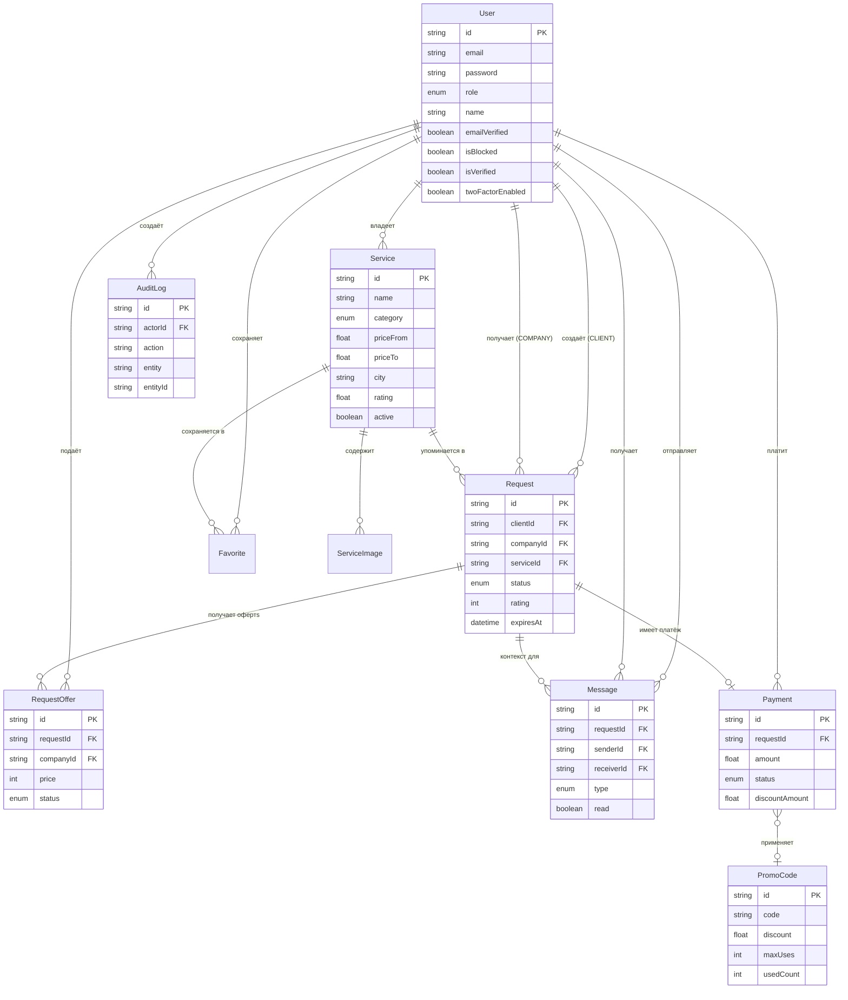
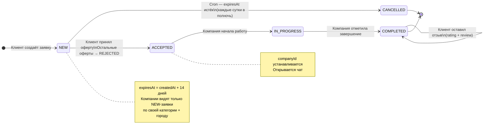
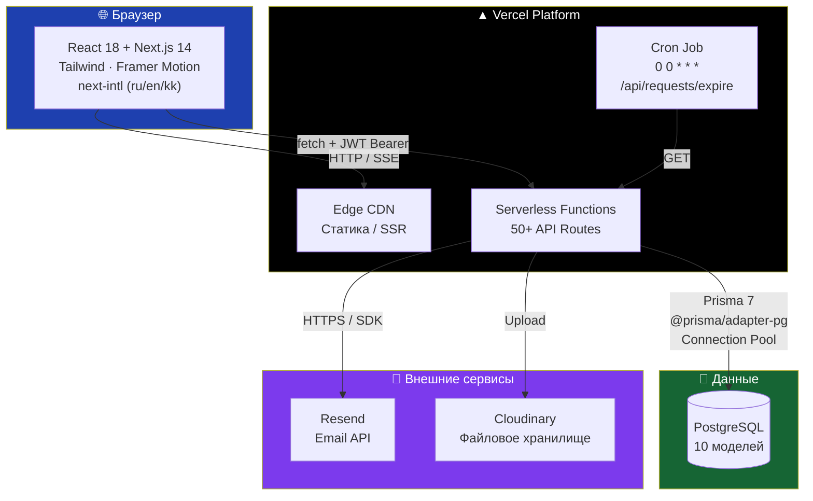
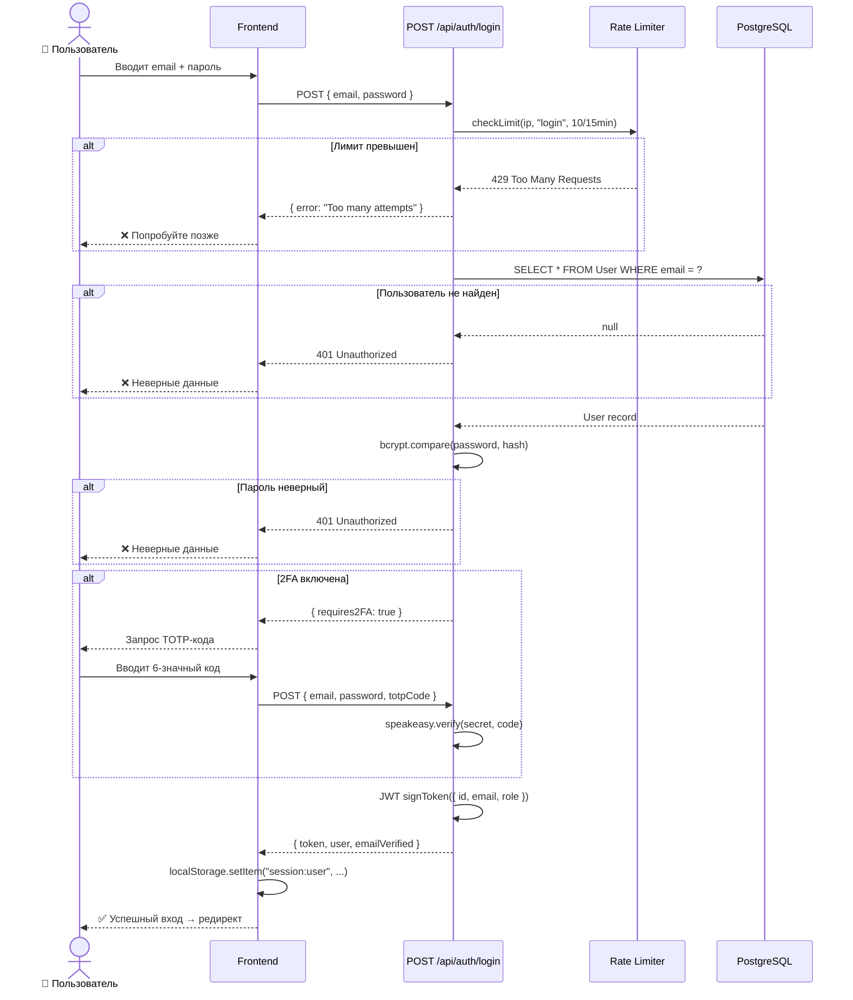
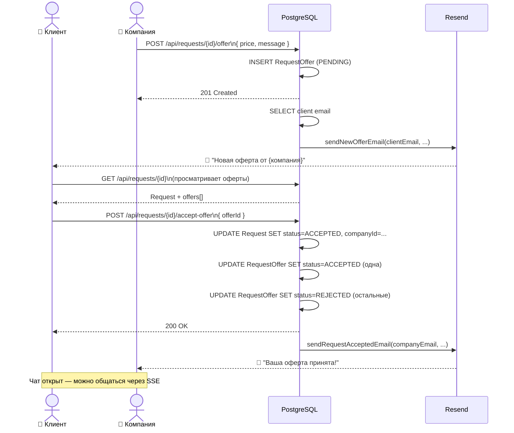
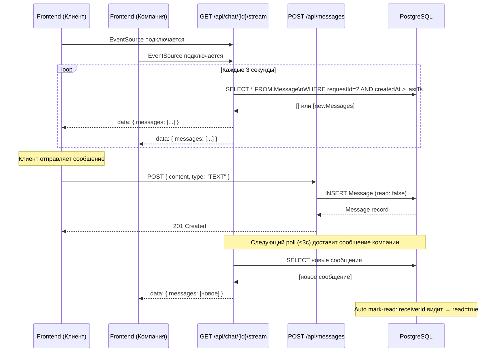
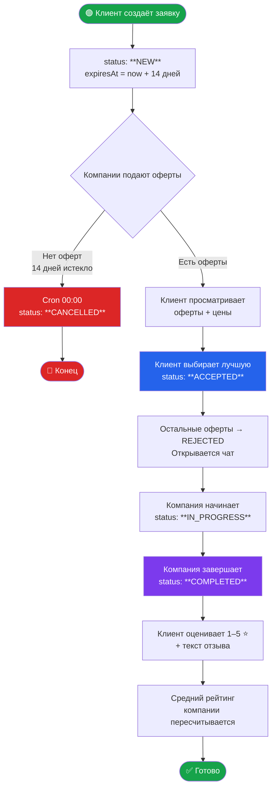
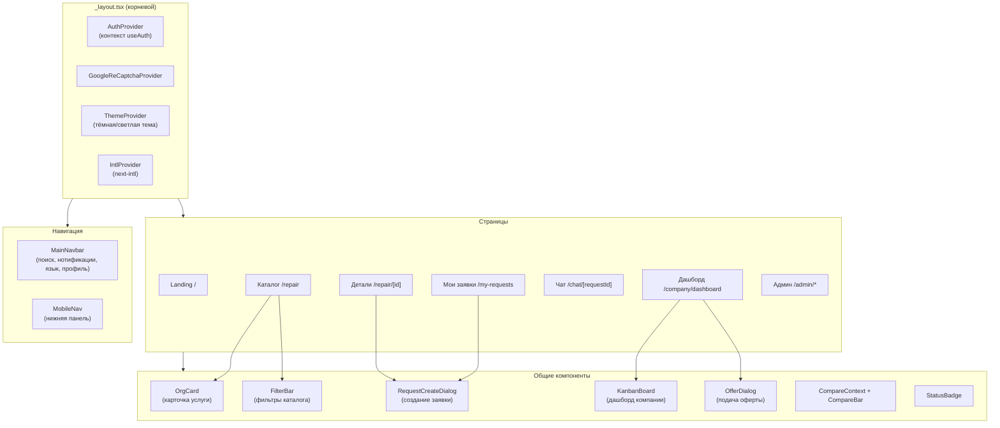
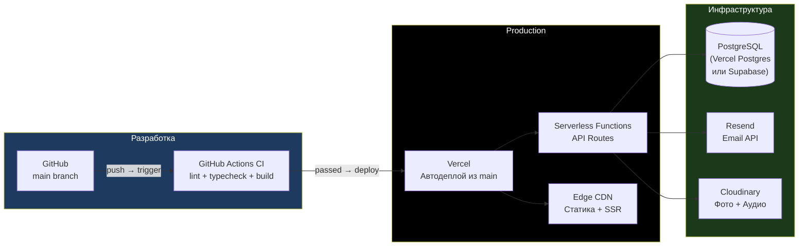
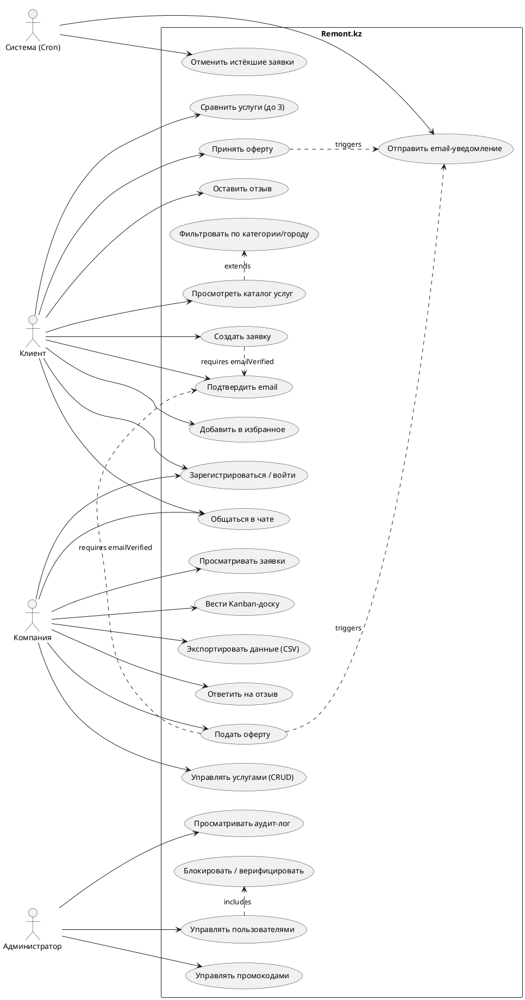

# Дипломная работа — Remont.kz
## Маркетплейс ремонтных услуг Казахстана

---

## 1. ОБЩИЕ СВЕДЕНИЯ О ПРОЕКТЕ

**Название:** Remont.kz — веб-платформа для поиска и заказа ремонтных и строительных услуг в Казахстане

**Тип:** Полнофункциональное веб-приложение (Full-stack web application)

**Год:** 2026

**Технологии:** Next.js 14, TypeScript, PostgreSQL, Prisma 7, Tailwind CSS, Framer Motion, next-intl

**Ссылка на репозиторий:** https://github.com/Asanali2077/remont_kz

---

## 2. АКТУАЛЬНОСТЬ ТЕМЫ

Рынок ремонтных и строительных услуг в Казахстане обладает рядом системных проблем:

- **Отсутствие прозрачности:** клиенты не имеют доступа к достоверным отзывам и рейтингам подрядчиков
- **Информационная асимметрия:** поиск исполнителей происходит через сарафанное радио, объявления в мессенджерах, что неэффективно и ненадёжно
- **Нет конкурентного механизма ценообразования:** клиент не может сравнить предложения нескольких компаний на один запрос
- **Языковой барьер:** большинство цифровых платформ не адаптированы для казахоязычной аудитории
- **Отсутствие контроля статуса:** нет инструментов отслеживания хода выполнения заказа

Remont.kz решает эти проблемы, предоставляя единую цифровую площадку с системой тендерных заявок, рейтингами, чатом и многоязычным интерфейсом.

---

## 3. ЦЕЛИ И ЗАДАЧИ

### Цель
Разработать веб-платформу, которая автоматизирует процесс поиска, выбора и взаимодействия между клиентами и поставщиками ремонтных услуг в Казахстане.

### Задачи
1. Спроектировать реляционную базу данных для хранения пользователей, услуг, заявок и коммуникаций
2. Реализовать систему аутентификации с JWT, верификацией email и двухфакторной аутентификацией
3. Разработать механизм тендерных заявок (клиент публикует → компании делают оферты → клиент выбирает)
4. Реализовать real-time чат между клиентом и исполнителем
5. Построить систему рейтингов и отзывов для объективной оценки компаний
6. Обеспечить многоязычность (русский, казахский, английский)
7. Разработать административную панель для управления платформой
8. Настроить CI/CD и контейнеризацию для production-деплоя

---

## 4. АНАЛИЗ СУЩЕСТВУЮЩИХ РЕШЕНИЙ

| Платформа | Страна | Недостатки для KZ |
|-----------|--------|--------------------|
| Profi.ru | Россия | Ориентирован на РФ, нет казахского языка, нет тенге |
| YouDo | Россия | Нет локализации, не адаптирован к казахскому рынку |
| Kolesa.kz / Krisha.kz | KZ | Узкая специализация (авто / недвижимость), нет ремонтных услуг |
| WhatsApp-объявления | — | Нет рейтингов, нет структуры, нет безопасности сделки |

**Вывод:** На казахстанском рынке отсутствует универсальный маркетплейс ремонтных услуг с полным циклом — от публикации заявки до оценки результата.

---

## 5. ТЕХНОЛОГИЧЕСКИЙ СТЕК И ОБОСНОВАНИЕ ВЫБОРА

### 5.1 Frontend + Backend — Next.js 14 (App Router)

**Обоснование:**
- Единая кодовая база для клиентской и серверной логики (монорепо)
- Server-Side Rendering (SSR) обеспечивает SEO-оптимизацию каталога услуг
- App Router с React Server Components снижает объём JS, отправляемого клиенту
- API Routes в том же проекте устраняют необходимость отдельного backend-сервера
- Широкая экосистема, активная поддержка Vercel

### 5.2 TypeScript

**Обоснование:**
- Статическая типизация выявляет ошибки на этапе компиляции
- Облегчает рефакторинг в крупной кодовой базе
- Автодополнение снижает количество опечаток в именах полей

### 5.3 PostgreSQL + Prisma 7

**Обоснование:**
- PostgreSQL: надёжная реляционная СУБД с поддержкой JSONB, индексов, каскадного удаления
- Prisma: типобезопасный ORM, автогенерация клиента из схемы, удобные миграции
- `@prisma/adapter-pg` — pool-based адаптер вместо стандартного движка: критично для Vercel Serverless Functions, где каждый вызов создаёт новый Node.js процесс; пул переиспользует соединения

### 5.4 Tailwind CSS + shadcn/ui

**Обоснование:**
- Utility-first CSS: нет конфликтов имён, лёгкое переопределение стилей
- shadcn/ui — компоненты копируются в проект (не зависимость), поэтому легко кастомизируются
- Radix UI в основе shadcn обеспечивает доступность (ARIA)

### 5.5 Framer Motion

**Обоснование:**
- Декларативные анимации (не CSS keyframes): логика анимаций в JSX рядом с компонентом
- Поддержка `AnimatePresence` для анимаций монтирования/размонтирования
- Используется на landing page, about page, in modal transitions

### 5.6 next-intl

**Обоснование:**
- Встроенная поддержка App Router (не устаревший pages router)
- Маршрутизация по локали через `app/[locale]/` — каждая страница доступна на 3 языках
- ICU message format для правильного склонения чисел

### 5.7 JWT + bcrypt (статeless аутентификация)

**Обоснование:**
- Stateless: серверу не нужно хранить сессии, что совместимо с serverless-деплоем
- bcrypt с 12 раундами соления — стандарт индустрии для хранения паролей
- Токен в `localStorage` с проверкой на каждый API-запрос через `Authorization: Bearer`

### 5.8 Resend (Email)

**Обоснование:**
- HTTP SDK, а не SMTP — SMTP использует TCP-соединения, которые заблокированы в Vercel Serverless Functions
- Надёжная доставка, webhook-подтверждения, встроенная аналитика

### 5.9 Server-Sent Events (SSE) для чата

**Обоснование:**
- WebSockets требуют persistent-соединения, несовместимых с Vercel Serverless
- SSE работает поверх обычного HTTP GET, Vercel поддерживает streaming responses
- Однонаправленный канал (сервер → клиент) достаточен: клиент отправляет через REST POST

### 5.10 reCAPTCHA v3

**Обоснование:**
- Защита форм регистрации и логина от bot-атак без UI-прерывания пользователя (v3 — невидимый)
- Серверная верификация токена в `lib/recaptcha.ts`

---

## 6. АРХИТЕКТУРА СИСТЕМЫ

### 6.1 Общая схема

```
┌─────────────────────────────────────────────────┐
│                  КЛИЕНТ (браузер)               │
│  React 18 + Next.js 14 App Router               │
│  Tailwind CSS, shadcn/ui, Framer Motion         │
│  next-intl (ru / en / kk)                       │
└──────────────────────┬──────────────────────────┘
                       │ HTTP / SSE
┌──────────────────────▼──────────────────────────┐
│              NEXT.JS SERVER (API Routes)        │
│  /api/* — 50+ маршрутов                         │
│  JWT middleware (lib/middleware.ts)             │
│  Zod validation, rate limiting                  │
│  Email: Resend SDK                              │
│  File uploads: Cloudinary / local disk          │
└──────────────────────┬──────────────────────────┘
                       │ Prisma 7 + @prisma/adapter-pg
┌──────────────────────▼──────────────────────────┐
│              PostgreSQL                         │
│  10 моделей, индексы, каскадное удаление        │
└─────────────────────────────────────────────────┘
```

### 6.2 Структура директорий

```
remont_kz/
├── app/
│   ├── [locale]/            # Все страницы с i18n-маршрутизацией
│   │   ├── page.tsx         # Landing page
│   │   ├── repair/          # Каталог услуг + детальная страница
│   │   ├── company/         # Профиль + дашборд компании
│   │   ├── companies/       # Справочник компаний
│   │   ├── my-requests/     # Дашборд клиента
│   │   ├── chat/            # Чат (список + тред)
│   │   ├── favorites/       # Избранное
│   │   ├── compare/         # Сравнение услуг
│   │   ├── profile/         # Профиль пользователя
│   │   ├── settings/        # Безопасность (пароль, 2FA)
│   │   ├── billing/         # Биллинг (только для компаний)
│   │   ├── guide/           # FAQ / Помощь
│   │   ├── about/           # О проекте
│   │   ├── admin/           # Административная панель
│   │   └── payment/         # Оплата (только для компаний)
│   └── api/                 # 50+ API-маршрутов
├── components/              # React-компоненты
│   ├── auth/                # AuthProvider, AuthModal
│   ├── company/             # Kanban, статистика, управление услугами
│   ├── nav/                 # Navbar, MobileNav
│   └── filters/             # FilterBar
├── lib/                     # Утилиты
│   ├── api.ts               # API-клиент (singleton)
│   ├── auth.ts              # JWT + bcrypt
│   ├── db.ts                # Prisma singleton (кэш на globalThis)
│   ├── email.ts             # Email-шаблоны (6 типов)
│   ├── middleware.ts         # Охранники маршрутов
│   ├── types.ts             # TypeScript-типы фронтенда
│   ├── utils.ts             # cn(), fmtNum(), timeAgo()
│   ├── upload.ts            # Загрузка файлов
│   └── use-notifications.ts # Хук для нотификаций
├── prisma/
│   ├── schema.prisma        # 10 моделей БД
│   └── seed.ts              # Демо-данные
├── messages/                # i18n: ru.json, en.json, kk.json
├── i18n/                    # Конфигурация next-intl
├── public/                  # Статика (изображения, иконки)
├── vercel.json              # Cron задачи
├── Dockerfile               # Контейнеризация
└── .github/workflows/ci.yml # CI/CD пайплайн
```

### 6.3 Роли пользователей

| Роль | Описание | Доступные функции |
|------|----------|-------------------|
| `CLIENT` | Заказчик | Публиковать заявки, выбирать оферты, чат, оценки, избранное |
| `COMPANY` | Исполнитель | Управлять услугами, делать оферты, Kanban, экспорт, биллинг |
| `ADMIN` | Администратор | Управление пользователями, модерация, аудит, промокоды |

---

## 7. СХЕМА БАЗЫ ДАННЫХ

### 7.1 Диаграмма связей (ERD — краткая)

```
User ──< Service ──< ServiceImage
 │           │
 │           └──< Favorite
 │
 ├──< Request (как клиент) ──< RequestOffer ──< User (как компания)
 │        │
 │        ├──< Message
 │        └── Payment ──> PromoCode
 │
 ├──< AuditLog
 └──< Payment
```

### 7.2 Описание всех 10 моделей

#### User
Центральная модель. Объединяет клиентов, компании и администраторов.

| Поле | Тип | Описание |
|------|-----|----------|
| `id` | UUID | Первичный ключ |
| `email` | String @unique | Логин |
| `password` | String | bcrypt-хэш (12 раундов) |
| `role` | UserRole | CLIENT / COMPANY / ADMIN |
| `name` | String? | Имя / название компании |
| `phone` | String? | Телефон |
| `avatarUrl` | String? | URL аватара |
| `address` | String? | Адрес |
| `description` | Text? | Описание компании |
| `lastActiveAt` | DateTime? | Последняя активность |
| `emailVerified` | Boolean | Подтверждён ли email |
| `emailVerifyToken` | String? @unique | Токен для верификации email |
| `resetToken` | String? @unique | Токен сброса пароля |
| `resetTokenExpiresAt` | DateTime? | Срок действия токена сброса |
| `isBlocked` | Boolean | Заблокирован ли пользователь |
| `blockReason` | String? | Причина блокировки |
| `isVerified` | Boolean | Верифицирована ли компания администратором |
| `twoFactorSecret` | String? | Секрет TOTP для 2FA |
| `twoFactorEnabled` | Boolean | Включена ли двухфакторная аутентификация |

**Индексы:** `email`, `role`

#### Service
Объявление компании об услуге.

| Поле | Тип | Описание |
|------|-----|----------|
| `id` | UUID | Первичный ключ |
| `name` | String | Название услуги |
| `category` | ServiceCategory | Категория (10 значений) |
| `description` | Text | Описание |
| `priceFrom` | Float | Цена от (тенге) |
| `priceTo` | Float | Цена до (тенге) |
| `active` | Boolean | Показывать в каталоге |
| `city` | String? | Город |
| `rating` | Float? | Средний рейтинг (вычисляется) |
| `licensed` | Boolean | Наличие лицензии |
| `tags` | String[] | Теги для поиска |
| `address` | String? | Адрес |
| `lat` / `lng` | Float? | Координаты для карты |
| `companyId` | FK → User | Владелец |

**Индексы:** `companyId`, `category`, `city`, `active`

#### ServiceImage
До 10 изображений на услугу с порядком сортировки.

#### Request
Заявка клиента на выполнение работы.

| Поле | Тип | Описание |
|------|-----|----------|
| `id` | UUID | Первичный ключ |
| `clientId` | FK → User | Заказчик |
| `serviceId` | FK → Service? | Привязка к конкретной услуге (опционально) |
| `companyId` | FK → User? | Назначенная компания (после принятия оферты) |
| `description` | Text | Описание проблемы |
| `category` | ServiceCategory? | Категория |
| `city` | String? | Город |
| `status` | RequestStatus | NEW / ACCEPTED / IN_PROGRESS / COMPLETED / CANCELLED |
| `rating` | Int? | Оценка клиента (1–5) |
| `review` | Text? | Текст отзыва |
| `companyReply` | Text? | Ответ компании на отзыв |
| `budgetFrom` / `budgetTo` | Float? | Ожидаемый бюджет |
| `finalPrice` | Int? | Итоговая согласованная цена |
| `expiresAt` | DateTime? | Срок действия заявки (14 дней) |
| `deadline` | DateTime? | Желаемый срок выполнения |

**Индексы:** `clientId`, `companyId`, `serviceId`, `status`, `category`, `city`, `expiresAt`, составной `(category, city, status)`

#### RequestOffer
Предложение (оферта) компании на заявку клиента.

| Поле | Тип | Описание |
|------|-----|----------|
| `requestId` | FK → Request | Заявка |
| `companyId` | FK → User | Компания |
| `price` | Int | Предложенная цена (тенге) |
| `message` | String? | Сопроводительное сообщение |
| `status` | OfferStatus | PENDING / ACCEPTED / REJECTED |

**Ограничение:** `@@unique([requestId, companyId])` — одна компания может подать одну оферту на заявку.

#### Message
Сообщение в чате (привязано к заявке).

| Поле | Тип | Описание |
|------|-----|----------|
| `requestId` | FK → Request? | Контекст разговора |
| `senderId` | FK → User | Отправитель |
| `receiverId` | FK → User | Получатель |
| `content` | Text | Текст или описание |
| `type` | MessageType | TEXT / IMAGE / AUDIO |
| `imageUrl` | String? | URL изображения |
| `audioUrl` | String? | URL голосового сообщения |
| `read` | Boolean | Прочитано ли |

#### Favorite
Избранные услуги клиента. `@@unique([userId, serviceId])` — без дублей.

#### Payment
Платёж, привязанный к заявке. Поддерживает промокоды и Kaspi.

| Поле | Тип | Описание |
|------|-----|----------|
| `requestId` | FK → Request @unique | Одна оплата на заявку |
| `clientId` | FK → User | Плательщик |
| `amount` | Float | Сумма |
| `status` | PaymentStatus | PENDING / PAID / FAILED / REFUNDED |
| `method` | String | card / kaspi |
| `discountAmount` | Float | Скидка по промокоду |
| `promoCodeId` | FK → PromoCode? | Применённый промокод |
| `kaspiOrderId` | String? | ID заказа Kaspi Pay |
| `paidAt` | DateTime? | Время оплаты |

#### AuditLog
Журнал действий администратора.

| Поле | Тип | Описание |
|------|-----|----------|
| `actorId` | FK → User | Кто совершил действие |
| `action` | String | Код действия (USER_BLOCKED, SERVICE_DELETED…) |
| `entity` | String | Тип сущности |
| `entityId` | String | ID сущности |
| `metadata` | Json? | Дополнительные данные |

#### PromoCode
Промокоды со скидкой в процентах.

| Поле | Тип | Описание |
|------|-----|----------|
| `code` | String @unique | Код |
| `discount` | Float | Скидка 0–100% |
| `maxUses` | Int? | Максимум использований (null = безлимит) |
| `usedCount` | Int | Текущее количество использований |
| `expiresAt` | DateTime? | Срок действия |
| `isActive` | Boolean | Активен ли |

### 7.3 Перечисления (Enums)

```
UserRole:        CLIENT | COMPANY | ADMIN
ServiceCategory: AUTOMOBILES | REAL_ESTATE | PLUMBING | ELECTRICAL |
                 PAINTING | CLEANING | RENOVATION | WELDING | ROOFING | OTHER
OfferStatus:     PENDING | ACCEPTED | REJECTED
RequestStatus:   NEW | ACCEPTED | IN_PROGRESS | COMPLETED | CANCELLED
MessageType:     TEXT | IMAGE | AUDIO
PaymentStatus:   PENDING | PAID | FAILED | REFUNDED
```

---

## 8. ЖИЗНЕННЫЙ ЦИКЛ ЗАЯВКИ

```
1. Клиент публикует заявку (статус: NEW)
   → Заявка действует 14 дней (expiresAt = createdAt + 14 days)
   → Cron-задача каждый час переводит истёкшие заявки в CANCELLED

2. Компании видят заявки, соответствующие их категории и городу
   → Компания подаёт оферту (RequestOffer, статус: PENDING)
   → Клиент получает email-уведомление о новой оферте

3. Клиент выбирает лучшую оферту (статус заявки: ACCEPTED)
   → Принятая оферта → ACCEPTED
   → Все остальные оферты → REJECTED
   → Компания получает email-уведомление о принятии
   → Открывается чат между клиентом и компанией

4. Компания ведёт работу:
   ACCEPTED → IN_PROGRESS → COMPLETED

5. Клиент оставляет оценку (1–5 звёзд) + текст отзыва
   → Средний рейтинг компании пересчитывается по всем её услугам
   → Компания может ответить на отзыв (companyReply)
```

---

## 9. API МАРШРУТЫ (полный список)

### Аутентификация
| Маршрут | Метод | Доступ | Описание |
|---------|-------|--------|----------|
| `/api/auth/register` | POST | — | Регистрация (Zod, reCAPTCHA, rate-limit 5/час) |
| `/api/auth/login` | POST | — | Вход (rate-limit 10/15мин), возвращает emailVerified |
| `/api/auth/me` | GET / DELETE | Любой | Текущий пользователь / удаление аккаунта |
| `/api/auth/profile` | GET / PUT | Любой | Просмотр/обновление профиля |
| `/api/auth/password` | PUT | Любой | Смена пароля |
| `/api/auth/verify-email` | GET | — | Верификация email по токену |
| `/api/auth/forgot-password` | POST | — | Отправка письма сброса |
| `/api/auth/reset-password` | POST | — | Установка нового пароля |
| `/api/auth/2fa` | GET / POST / DELETE | Любой | Управление двухфакторной аутентификацией |

### Услуги
| Маршрут | Метод | Доступ | Описание |
|---------|-------|--------|----------|
| `/api/services` | GET / POST | POST=Компания | Список/создание услуг |
| `/api/services/[id]` | GET / PUT / DELETE | PUT/DELETE=Компания | CRUD услуги |
| `/api/services/[id]/reviews` | GET | — | Отзывы на услугу |
| `/api/services/[id]/similar` | GET | — | Похожие услуги |
| `/api/services/[id]/images` | GET / POST | POST=Компания | Изображения услуги |
| `/api/services/[id]/images/[imageId]` | DELETE | Компания | Удаление изображения |

### Заявки
| Маршрут | Метод | Доступ | Описание |
|---------|-------|--------|----------|
| `/api/requests` | GET / POST | POST=Клиент | Список/создание заявок |
| `/api/requests/[id]` | GET / PUT / DELETE | — | Детали/обновление/отмена |
| `/api/requests/[id]/offer` | POST / DELETE | Компания | Подать/отозвать оферту |
| `/api/requests/[id]/accept-offer` | POST | Клиент | Принять оферту |
| `/api/requests/[id]/rate` | POST | Клиент | Оценить выполненную заявку |
| `/api/requests/[id]/reply` | PUT | Компания | Ответить на отзыв |
| `/api/requests/expire` | GET | — | Пометить истёкшие (Vercel cron) |

### Чат и сообщения
| Маршрут | Метод | Доступ | Описание |
|---------|-------|--------|----------|
| `/api/messages` | GET / POST | Любой | Сообщения чата |
| `/api/messages/upload` | POST | Любой | Загрузка изображения/аудио |
| `/api/messages/mark-read` | POST | Любой | Пометить прочитанными |
| `/api/chat` | GET | Любой | Список чатов (inbox) |
| `/api/chat/[requestId]/stream` | GET | Любой | SSE — real-time чат |
| `/api/chat/[requestId]/typing` | POST | Любой | Индикатор печати |

### Компании и статистика
| Маршрут | Метод | Доступ | Описание |
|---------|-------|--------|----------|
| `/api/companies` | GET | — | Список компаний |
| `/api/company/[id]` | GET | — | Публичный профиль компании |
| `/api/company/stats` | GET | Компания | Статистика дашборда |
| `/api/company/export` | GET | Компания | Экспорт CSV |
| `/api/stats` | GET | — | Общая статистика платформы |

### Прочее
| Маршрут | Метод | Доступ | Описание |
|---------|-------|--------|----------|
| `/api/favorites` | GET / POST | Клиент | Список/добавление в избранное |
| `/api/favorites/[serviceId]` | DELETE | Клиент | Удаление из избранного |
| `/api/notifications/count` | GET | Любой | Количество непрочитанных |
| `/api/payments/[requestId]` | GET / POST | Любой | Платёж |
| `/api/payments/[requestId]/confirm` | POST | Любой | Подтверждение платежа |
| `/api/promo/validate` | POST | Клиент | Валидация промокода |
| `/api/health` | GET | — | Проверка состояния БД |
| `/api/files/[...path]` | GET | — | Отдача загруженных файлов |

### Администрирование (`/api/admin/*`)
| Маршрут | Метод | Описание |
|---------|-------|----------|
| `/api/admin/users` | GET | Список пользователей |
| `/api/admin/users/[id]` | GET / PUT / DELETE | Управление пользователем (блокировка, верификация) |
| `/api/admin/services` | GET | Все услуги |
| `/api/admin/services/[id]` | DELETE | Удаление услуги |
| `/api/admin/requests` | GET | Все заявки |
| `/api/admin/audit` | GET | Журнал действий |
| `/api/admin/stats` | GET | Сводная статистика |
| `/api/admin/promo` | GET / POST | Управление промокодами |
| `/api/admin/promo/[id]` | PUT / DELETE | Редактирование промокода |

---

## 10. АУТЕНТИФИКАЦИЯ И БЕЗОПАСНОСТЬ

### 10.1 JWT (JSON Web Token)

- Алгоритм подписи: HS256
- Срок действия токена: 7 дней
- Токен хранится в `localStorage` под ключом `session:user` в формате `{ token, id, email, role, name, phone }`
- Передаётся через заголовок `Authorization: Bearer <token>`
- `lib/auth.ts`: функции `signToken()`, `verifyToken()`, `hashPassword()`, `verifyPassword()`

### 10.2 Охранники маршрутов (`lib/middleware.ts`)

```typescript
requireAuth()        // любой авторизованный пользователь
requireClient()      // только роль CLIENT
requireCompany()     // только роль COMPANY
requireAdmin()       // только роль ADMIN
assertEmailVerified()// email должен быть подтверждён
```

### 10.3 Верификация email

1. При регистрации генерируется уникальный `emailVerifyToken` (UUID)
2. Ссылка `{BASE_URL}/verify-email?token=...` отправляется через Resend
3. При переходе по ссылке: токен ищется в БД, поле `emailVerified` устанавливается в `true`, токен обнуляется
4. Создание услуги и подача оферты требуют `emailVerified = true`

### 10.4 Двухфакторная аутентификация (2FA)

- TOTP (Time-based One-Time Password) по стандарту RFC 6238
- Библиотека: `speakeasy`
- Секрет генерируется на сервере, QR-код возвращается в base64 для сканирования приложением (Google Authenticator, Authy)
- После включения 2FA: при логине требуется 6-значный код вместе с паролем
- Секрет хранится в поле `twoFactorSecret` в БД

### 10.5 Сброс пароля

1. Клиент запрашивает сброс → генерируется `resetToken` (UUID) со сроком 1 час
2. Ссылка отправляется на email
3. Клиент переходит по ссылке, вводит новый пароль
4. Сервер проверяет токен и срок → обновляет хэш пароля, обнуляет токен

### 10.6 Rate Limiting

- Реализован в памяти (`Map`) в `lib/rate-limit.ts`
- Регистрация: 5 запросов/час с одного IP
- Логин: 10 запросов/15 минут с одного IP
- Очистка: автоматически каждые 5 минут

### 10.7 Валидация данных (Zod)

- Все входящие данные API-маршрутов валидируются через Zod-схемы
- Пример: схема регистрации проверяет email, пароль (мин. 8 символов + 1 цифра), имя

### 10.8 Защита от XSS

- `sanitizeText()` в `lib/utils.ts` удаляет HTML-теги из всего пользовательского ввода
- Вызывается перед сохранением описаний, отзывов и сообщений в БД

### 10.9 reCAPTCHA v3 (инфраструктура готова, не подключена)

- Серверный верификатор реализован в `lib/recaptcha.ts`
- Библиотека `react-google-recaptcha-v3` присутствует в `package.json`
- **Фактически не интегрирована:** ни `AuthModal`, ни API-маршруты `/auth/register` и `/auth/login` не вызывают reCAPTCHA
- Защиту от ботов обеспечивает rate limiting (`lib/rate-limit.ts`)

---

## 11. ФУНКЦИОНАЛЬНОСТЬ ПО РОЛЯМ

### 11.1 Клиент (CLIENT)

**Каталог услуг (`/repair`)**
- Фильтрация по категории (10), городу, цене (range slider), рейтингу, тегам
- Переключение вид: сетка / список / карта (Leaflet)
- Поиск по названию и описанию (debounce 300мс)
- Сортировка: по рейтингу, цене, дате

**Детальная страница услуги (`/repair/[id]`)**
- Галерея изображений
- Рейтинг и отзывы с пагинацией
- Похожие услуги
- Кнопка «Оставить заявку» → диалог создания заявки
- Добавить в избранное / сравнение

**Мои заявки (`/my-requests`)**
- Список всех заявок с фильтрацией по статусу
- Таймлайн статусов для каждой заявки
- Список полученных оферт с ценами
- Кнопка принятия оферты
- Просмотр чата для принятой заявки

**Чат (`/chat`, `/chat/[requestId]`)**
- Список активных диалогов с последним сообщением и счётчиком непрочитанных
- Real-time обновление через SSE (Server-Sent Events)
- Отправка текста, изображений, голосовых сообщений
- Индикатор прочтения

**Избранное (`/favorites`)**
- Сохранённые услуги
- Быстрый переход к услуге или созданию заявки

**Сравнение (`/compare`)**
- До 3 услуг одновременно
- Сравнение характеристик: цена, рейтинг, категория, город, описание

**Профиль и настройки**
- Редактирование имени, телефона, адреса, аватара
- Смена пароля (требует ввода текущего)
- Управление 2FA (QR-код + верификация)

### 11.2 Компания (COMPANY)

**Дашборд (`/company/dashboard`)**
- Kanban-доска заявок: NEW / ACCEPTED / IN_PROGRESS / COMPLETED
- Перетаскивание карточек (drag-and-drop) для смены статуса
- Статистика: доход, количество заявок по статусам, рейтинг, новые клиенты
- Графики (Recharts): бар-чарт дохода, pie-чарт по категориям

**Управление услугами**
- CRUD: создание, редактирование, удаление услуг
- Загрузка до 10 изображений
- Активация/деактивация услуги

**Оферты**
- Просмотр заявок подходящих по категории и городу
- Подача оферты с ценой и сопроводительным сообщением
- Отзыв оферты до принятия

**Экспорт**
- Экспорт данных по заявкам в CSV (`/api/company/export`)

**Биллинг (`/billing`)**
- Просмотр тарифных планов (страница только для компаний)

### 11.3 Администратор (ADMIN)

**Панель администратора (`/admin/*`)**
- Управление пользователями: блокировка, верификация, просмотр профиля
- Модерация услуг: просмотр, удаление нарушающих правила
- Просмотр всех заявок
- Журнал аудита: все административные действия с метаданными
- Управление промокодами: создание, редактирование, деактивация

---

## 12. ИНТЕРНАЦИОНАЛИЗАЦИЯ (i18n)

### Реализация
- Библиотека: `next-intl` v4
- Маршрутизация: `app/[locale]/` — каждая страница доступна по `/ru/...`, `/en/...`, `/kk/...`
- Локали: **ru** (русский, по умолчанию), **en** (английский), **kk** (казахский)

### Файлы переводов
```
messages/
├── ru.json  ~650 ключей
├── en.json  ~650 ключей
└── kk.json  ~650 ключей
```

### Конфигурация
```
i18n/routing.ts    # Определение локалей и defaultLocale
i18n/request.ts    # Загрузка сообщений per-request
i18n/config.ts     # Экспорт констант
```

### Переключатель языков
- В Navbar: кликабельные флаги/коды языков
- Сохраняется в URL — поисковики индексируют отдельные версии

---

## 13. REAL-TIME ЧАТ

### Архитектура (Server-Sent Events)

```
Клиент                            Сервер
  │                                   │
  ├── GET /api/chat/[id]/stream ─────►│
  │   (открывает SSE-соединение)      │
  │                                   │
  │◄──── data: {...messages} ─────────│ (каждые 3 сек)
  │◄──── data: {...messages} ─────────│
  │                                   │
  ├── POST /api/messages ────────────►│ (отправить сообщение)
  │                                   │
  │◄──── data: {newMessage} ──────────│ (следующий poll)
```

### Детали реализации
- Сервер опрашивает БД каждые 3 секунды для новых сообщений с `createdAt > lastTimestamp`
- Соединение автоматически закрывается по `request.signal` (пользователь покинул страницу)
- Новые полученные сообщения автоматически помечаются как прочитанные
- `Content-Type: text/event-stream`, `Cache-Control: no-cache`

### Типы сообщений
- **TEXT** — текст
- **IMAGE** — изображение (загружается через `/api/messages/upload`)
- **AUDIO** — голосовое сообщение (Web Audio API на клиенте)

---

## 14. EMAIL УВЕДОМЛЕНИЯ

### Провайдер
**Resend** (HTTP SDK) — выбран вместо Nodemailer SMTP, так как Vercel Serverless Functions блокируют TCP-соединения, а Resend работает через HTTPS.

### 6 шаблонов
| Функция | Триггер |
|---------|---------|
| `sendVerificationEmail` | Регистрация нового пользователя |
| `sendPasswordResetEmail` | Запрос сброса пароля |
| `sendWelcomeEmail` | Успешная верификация email |
| `sendNewOfferEmail` | Компания подала оферту → клиент |
| `sendRequestAcceptedEmail` | Клиент принял оферту → компания |
| `sendJobCompletedEmail` | Работа завершена → клиент (с просьбой оставить отзыв) |

### Конфигурация
```env
SMTP_PASS=re_xxxxxxxx       # Resend API ключ (название переменной устарело)
SMTP_FROM="Remont.kz <onboarding@resend.dev>"
```
Если `SMTP_PASS` не задан — письма выводятся в `console.log` (удобно в dev-среде).

---

## 15. ЗАГРУЗКА ФАЙЛОВ

### Поддерживаемые типы
- **Изображения**: JPEG, PNG, WebP, GIF (magic-byte валидация — не только расширение)
- **Аудио**: MP3, WAV, OGG, WebM

### Хранилище
- **Локальная разработка**: `public/uploads/images/` и `public/uploads/audio/`
  - Файлы отдаются через `/api/files/[...path]`
- **Production (Vercel)**: Cloudinary или S3-совместимое хранилище (переменные `S3_*`)
  - Vercel Serverless имеет эфемерную файловую систему — локальные файлы теряются при перезапуске

### Безопасность
- Magic-byte проверка: первые байты файла проверяются по сигнатуре типа
- Ограничение размера: изображения до 10 МБ, аудио до 25 МБ
- Уникальные имена файлов: UUID + оригинальное расширение

---

## 16. УВЕДОМЛЕНИЯ В ИНТЕРФЕЙСЕ

### Механизм
- Хук `lib/use-notifications.ts` опрашивает `/api/requests` каждые 30 секунд
- Строит список уведомлений: новые оферты, изменения статусов, новые сообщения
- `/api/notifications/count` — быстрый endpoint только для счётчика (бейдж на иконке)

### Защита от 401-петли
- Хук проверяет `localStorage.getItem("session:user")` перед запросом
- 300 мс задержка на первой загрузке (даёт AuthProvider время записать токен)

---

## 17. АДМИНИСТРАТИВНАЯ ПАНЕЛЬ

### Доступ
- Маршруты: `/admin/*`
- Авторизация: только роль `ADMIN`, нет ссылки в UI для обычных пользователей
- Все действия логируются в `AuditLog`

### Функции
1. **Пользователи** — поиск, фильтр по роли, блокировка с указанием причины, верификация компании
2. **Услуги** — просмотр всех услуг, удаление нарушающих правила
3. **Заявки** — мониторинг всех заявок на платформе
4. **Аудит** — лог всех административных действий (актор, действие, сущность, время)
5. **Промокоды** — CRUD промокодов: код, скидка %, лимит использований, срок действия

---

## 18. CRON-ЗАДАЧА: ЭКСПИРАЦИЯ ЗАЯВОК

```json
// vercel.json
{
  "crons": [
    { "path": "/api/requests/expire", "schedule": "0 * * * *" }
  ]
}
```

- Запускается **раз в сутки** (полночь по UTC) — ограничение Vercel Hobby плана
- Находит все заявки со статусом `NEW` и `expiresAt < now()`
- Переводит их в статус `CANCELLED`
- Заявки создаются с `expiresAt = createdAt + 14 дней`

---

## 19. ДЕПЛОЙ И ИНФРАСТРУКТУРА

### 19.1 Контейнеризация

**Dockerfile** (multi-stage build):
1. `deps` — установка только production-зависимостей
2. `builder` — сборка Next.js (`output: "standalone"`)
3. `runner` — минимальный образ с standalone-сборкой

**docker-compose.yml**:
- Сервис `app` (Next.js)
- Сервис `db` (PostgreSQL 15)
- Сеть между сервисами

### 19.2 CI/CD (GitHub Actions)

```yaml
# .github/workflows/ci.yml
jobs:
  ci:
    services:
      postgres:
        image: postgres:15
        # ...
    steps:
      - npm ci
      - npm run lint
      - npm run type-check
      - npm run db:push
      - npm run test
      - npm run build
```

Пайплайн на каждый push и pull request:
1. Установка зависимостей
2. Линтинг (ESLint)
3. Проверка типов (TypeScript)
4. Синхронизация схемы БД
5. Unit-тесты (Vitest)
6. Сборка production

### 19.3 Vercel (production)

- Автодеплой при push в `main`
- Serverless Functions для API-маршрутов
- Edge Network для статики
- Встроенные cron-задачи через `vercel.json`

### 19.4 Переменные окружения (production)

```env
DATABASE_URL             # PostgreSQL connection string
JWT_SECRET               # Секрет для подписи JWT
NEXT_PUBLIC_APP_URL      # Публичный URL приложения
SMTP_PASS                # Resend API ключ
SMTP_FROM                # From-адрес писем
NEXT_PUBLIC_RECAPTCHA_SITE_KEY
RECAPTCHA_SECRET_KEY
# Cloudinary / S3 для файлов (если не локально):
CLOUDINARY_CLOUD_NAME
CLOUDINARY_API_KEY
CLOUDINARY_API_SECRET
```

---

## 20. ТЕСТИРОВАНИЕ

### Unit-тесты (Vitest)
- Фреймворк: Vitest (совместим с Jest API, быстрее за счёт Vite)
- Запуск: `npm run test`

### Ручное тестирование
- 16 демо-аккаунтов (10 компаний, 6 клиентов) с seed-данными
- 20 услуг во всех категориях
- 30 заявок в разных статусах
- 11 оферт на открытые заявки

### Проверка типов
- `npm run type-check` — полная проверка TypeScript без сборки
- Обязательна перед коммитом (прописана в CI)

---

## 21. UX И ИНТЕРФЕЙС

### Дизайн-система
- **Тема**: светлая/тёмная (next-themes, системные предпочтения)
- **Цветовая схема**: синий (#3b82f6) основной, нейтральные серые
- **Типография**: системный шрифт, чёткая иерархия размеров
- **Анимации**: Framer Motion — FadeUp, FadeLeft, FadeRight, ScaleIn на всех ключевых блоках

### Адаптивность
- Mobile-first подход
- Breakpoints: sm (640px), md (768px), lg (1024px), xl (1280px)
- Мобильная навигация: нижний фиксированный navbar (`MobileNav.tsx`)
- Боковое меню на десктопе для клиента и настроек

### Ключевые UX-решения
- **Before/After слайдер** на главной: 5 пар «до/после» с автопрокруткой каждые 5 сек
- **Сравнение услуг**: плавающая CompareBar при выборе ≥2 услуг
- **Kanban для компаний**: визуальное управление статусами перетаскиванием
- **Cmd+K поиск**: глобальный поиск из любой точки приложения
- **Оффлайн-тост**: OfflineToast уведомляет о потере соединения
- **Skeleton loading**: заглушки вместо пустых экранов при загрузке

### Доступность
- Radix UI компоненты — полная поддержка ARIA
- Keyboard navigation
- Контраст цветов по WCAG 2.1 AA

---

## 22. МЕТАДАННЫЕ И SEO

- Динамические `metadata` объекты в каждой странице (Next.js 14 Metadata API)
- `app/sitemap.ts` — автогенерация карты сайта с реальными URL услуг и компаний
- `app/manifest.ts` — PWA manifest (иконка, название, цвет темы)
- `app/icon.png` — favicon (логотип Remont.kz, обрабатывается автоматически Next.js)
- Open Graph теги для корректного отображения при шеринге

---

## 23. МАППИНГ ENUM (критически важная деталь)

Prisma хранит категории в SCREAMING_SNAKE_CASE, фронтенд использует kebab-case:

| БД (Prisma) | Фронтенд |
|-------------|----------|
| `AUTOMOBILES` | `"automobiles"` |
| `REAL_ESTATE` | `"real-estate"` |
| `PLUMBING` | `"plumbing"` |
| `ELECTRICAL` | `"electrical"` |
| `PAINTING` | `"painting"` |
| `CLEANING` | `"cleaning"` |
| `RENOVATION` | `"renovation"` |
| `WELDING` | `"welding"` |
| `ROOFING` | `"roofing"` |
| `OTHER` | `"other"` |

Конвертация: функция `fromDbCategory()` в `lib/api.ts`. При добавлении новой категории необходимо обновить все три `categoryMap` объекта в маршрутах услуг и заявок.

---

## 24. ДЕМО-ДАННЫЕ (seed)

После `npm run db:seed` (пароль для всех: `password123`):

### Компании
| Email | Название | Категория | Город |
|-------|----------|-----------|-------|
| stroymast@remont.kz | StroiMaster | REAL_ESTATE | Алматы |
| autocity@remont.kz | AutoCity KZ | AUTOMOBILES | Астана |
| electroserv@remont.kz | ElectroServ | ELECTRICAL | Алматы |
| plumbing@remont.kz | PlumbingKZ | PLUMBING | Астана |
| cleanpro@remont.kz | CleanPro | CLEANING | Алматы |
| kazweld@remont.kz | KazWeld | WELDING | Алматы |
| roofpro@remont.kz | RoofPro KZ | ROOFING | Астана |
| paintmaster@remont.kz | PaintMaster | PAINTING | Алматы |
| renovkz@remont.kz | RenovKZ | RENOVATION | Шымкент |
| techmaster@remont.kz | TechMaster KZ | OTHER | Алматы |

### Клиенты
| Email | Имя |
|-------|-----|
| asel@remont.kz | Asel M. |
| dmitry@remont.kz | Dmitry K. |
| zarina@remont.kz | Zarina T. |
| arman@remont.kz | Arman S. |
| aibek@remont.kz | Aibek N. |
| nurgul@remont.kz | Nurgul B. |

### Данные
- **20 услуг** — по 2 на каждую категорию
- **30 заявок** — 13 COMPLETED (с отзывами), 4 IN_PROGRESS, 3 ACCEPTED, 10 NEW
- **11 оферт** — на открытые заявки
- **Сообщения в чате** — для принятых заявок

---

## 25. ИЗВЕСТНЫЕ ОГРАНИЧЕНИЯ И РЕШЕНИЯ

| Проблема | Решение |
|----------|---------|
| Vercel Serverless: SMTP TCP заблокирован | Resend HTTP SDK вместо Nodemailer |
| Vercel Serverless: нет персистентных WebSocket | SSE (Server-Sent Events) для real-time чата |
| Vercel Serverless: эфемерная файловая система | Cloudinary / S3 для production загрузок |
| Prisma + Serverless: connection pooling | `@prisma/adapter-pg` с `Pool` из пакета `pg` |
| Framer Motion + z-index: стекирующие контексты | CSS `mask-image` для визуального эффекта «под карточкой» |

---

## 26. УДАЛЁННЫЕ ФУНКЦИИ (намеренно)

| Функция | Причина |
|---------|---------|
| AI-чатбот (`AiRequestBot.tsx`) | OpenRouter free tier нестабилен, rate limits в production |
| AI-резюме услуг | Та же причина |
| `PortfolioPhoto` модель | Модель существовала в схеме, но UI/API никогда не реализованы |
| reCAPTCHA v3 в UI | Инфраструктура (`lib/recaptcha.ts`) есть, но не подключена к формам — защиту обеспечивает rate limiting |
| Оплата для клиентов | Remont.kz бесплатен для клиентов |
| Биллинг в сайдбаре клиента | Та же причина |

---

## 27. МЕТРИКИ ПРОЕКТА

| Метрика | Значение |
|---------|----------|
| Страниц в приложении | 30+ |
| API-маршрутов | 50+ |
| Моделей базы данных | 10 |
| Категорий услуг | 10 |
| Языков интерфейса | 3 (ru / en / kk) |
| Email-шаблонов | 6 |
| Компонентов React | 50+ |
| Демо-аккаунтов | 16 (10 компаний + 6 клиентов) |
| Демо-услуг | 20 |
| Демо-заявок | 30 |
| Строк TypeScript | ~15 000 |

---

## 28. ДИАГРАММЫ

> Все диаграммы написаны в формате **Mermaid** (воспроизводятся в GitHub, VS Code с расширением «Mermaid», Notion, draw.io через плагин).
> BPMN-процессы дополнительно описаны в XML-формате BPMN 2.0 для импорта в **bpmn.io** или **Camunda Modeler**.

---

### 28.1 ER-диаграмма (Mermaid)

Воспроизвести: вставить в [mermaid.live](https://mermaid.live) или в блок ```mermaid в GitHub/Notion.



---

### 28.2 Диаграмма состояний заявки (Mermaid)



---

### 28.3 Схема архитектуры (Mermaid)



---

### 28.4 Последовательность входа (Mermaid Sequence)



---

### 28.5 Последовательность подачи и принятия оферты (Mermaid Sequence)



---

### 28.6 Real-time чат через SSE (Mermaid Sequence)



---

### 28.7 BPMN — Основной бизнес-процесс (описание для bpmn.io)

> Скопируйте XML ниже в **https://bpmn.io** (File → Open from XML) для получения визуальной BPMN-диаграммы.

```xml
<?xml version="1.0" encoding="UTF-8"?>
<definitions xmlns="http://www.omg.org/spec/BPMN/20100524/MODEL"
             xmlns:xsi="http://www.w3.org/2001/XMLSchema-instance"
             targetNamespace="http://remont.kz/bpmn">

  <collaboration id="Collaboration_RemontKZ">

    <!-- ═══ POOL: КЛИЕНТ ═══ -->
    <participant id="Pool_Client" name="Клиент" processRef="Process_Client"/>

    <!-- ═══ POOL: КОМПАНИЯ ═══ -->
    <participant id="Pool_Company" name="Компания" processRef="Process_Company"/>

    <!-- ═══ POOL: СИСТЕМА ═══ -->
    <participant id="Pool_System" name="Система (Remont.kz)" processRef="Process_System"/>

    <!-- Message Flows между пулами -->
    <messageFlow id="MF_OfferNotify"   sourceRef="Task_SendOffer"     targetRef="Task_ViewOffer"/>
    <messageFlow id="MF_AcceptNotify"  sourceRef="Task_AcceptOffer"   targetRef="Task_ReceiveAccept"/>
    <messageFlow id="MF_CompleteNotify" sourceRef="Task_MarkComplete" targetRef="Task_RateJob"/>
  </collaboration>

  <!-- ════════════════════════════════════════════
       ПРОЦЕСС КЛИЕНТА
  ════════════════════════════════════════════ -->
  <process id="Process_Client" isExecutable="false">

    <startEvent id="Start_Client" name="Нужна услуга"/>

    <userTask id="Task_CreateRequest" name="Создать заявку&#10;(категория, описание, бюджет)"/>

    <intermediateCatchEvent id="Timer_Wait" name="Ожидание оферт">
      <timerEventDefinition>
        <timeDuration>P14D</timeDuration><!-- 14 дней -->
      </timerEventDefinition>
    </intermediateCatchEvent>

    <exclusiveGateway id="GW_OffersReceived" name="Есть оферты?"/>

    <userTask id="Task_ViewOffer" name="Просмотреть оферты&#10;и сравнить цены"/>

    <userTask id="Task_AcceptOffer" name="Принять лучшую&#10;оферту"/>

    <userTask id="Task_ChatWithCompany" name="Обсудить детали&#10;в чате"/>

    <userTask id="Task_RateJob" name="Оставить отзыв&#10;и рейтинг (1–5 ⭐)"/>

    <endEvent id="End_Client_OK" name="Заказ выполнен"/>
    <endEvent id="End_Client_Expired" name="Заявка истекла"/>

    <!-- Потоки -->
    <sequenceFlow sourceRef="Start_Client"         targetRef="Task_CreateRequest"/>
    <sequenceFlow sourceRef="Task_CreateRequest"   targetRef="Timer_Wait"/>
    <sequenceFlow sourceRef="Timer_Wait"           targetRef="GW_OffersReceived"/>
    <sequenceFlow sourceRef="GW_OffersReceived"    targetRef="Task_ViewOffer"      name="Да"/>
    <sequenceFlow sourceRef="GW_OffersReceived"    targetRef="End_Client_Expired"  name="Нет (14 дней)"/>
    <sequenceFlow sourceRef="Task_ViewOffer"       targetRef="Task_AcceptOffer"/>
    <sequenceFlow sourceRef="Task_AcceptOffer"     targetRef="Task_ChatWithCompany"/>
    <sequenceFlow sourceRef="Task_ChatWithCompany" targetRef="Task_RateJob"/>
    <sequenceFlow sourceRef="Task_RateJob"         targetRef="End_Client_OK"/>
  </process>

  <!-- ════════════════════════════════════════════
       ПРОЦЕСС КОМПАНИИ
  ════════════════════════════════════════════ -->
  <process id="Process_Company" isExecutable="false">

    <startEvent id="Start_Company" name="Новая заявка&#10;в категории"/>

    <userTask id="Task_ReviewRequest" name="Изучить заявку&#10;клиента"/>

    <exclusiveGateway id="GW_Interested" name="Интересно?"/>

    <userTask id="Task_SendOffer" name="Подать оферту&#10;(цена + сообщение)"/>

    <intermediateCatchEvent id="Catch_Decision" name="Ожидание решения&#10;клиента">
      <messageEventDefinition/>
    </intermediateCatchEvent>

    <exclusiveGateway id="GW_OfferAccepted" name="Оферта принята?"/>

    <userTask id="Task_ReceiveAccept" name="Получить уведомление&#10;о принятии"/>

    <userTask id="Task_DoWork_InProgress" name="Начать работу&#10;(IN_PROGRESS)"/>

    <userTask id="Task_MarkComplete" name="Отметить&#10;завершение (COMPLETED)"/>

    <endEvent id="End_Company_Done" name="Заказ выполнен"/>
    <endEvent id="End_Company_Rejected" name="Оферта отклонена"/>
    <endEvent id="End_Company_Skip" name="Не интересно"/>

    <!-- Потоки -->
    <sequenceFlow sourceRef="Start_Company"          targetRef="Task_ReviewRequest"/>
    <sequenceFlow sourceRef="Task_ReviewRequest"     targetRef="GW_Interested"/>
    <sequenceFlow sourceRef="GW_Interested"          targetRef="Task_SendOffer"          name="Да"/>
    <sequenceFlow sourceRef="GW_Interested"          targetRef="End_Company_Skip"        name="Нет"/>
    <sequenceFlow sourceRef="Task_SendOffer"         targetRef="Catch_Decision"/>
    <sequenceFlow sourceRef="Catch_Decision"         targetRef="GW_OfferAccepted"/>
    <sequenceFlow sourceRef="GW_OfferAccepted"       targetRef="Task_ReceiveAccept"      name="Принята"/>
    <sequenceFlow sourceRef="GW_OfferAccepted"       targetRef="End_Company_Rejected"    name="Отклонена"/>
    <sequenceFlow sourceRef="Task_ReceiveAccept"     targetRef="Task_DoWork_InProgress"/>
    <sequenceFlow sourceRef="Task_DoWork_InProgress" targetRef="Task_MarkComplete"/>
    <sequenceFlow sourceRef="Task_MarkComplete"      targetRef="End_Company_Done"/>
  </process>

  <!-- ════════════════════════════════════════════
       ПРОЦЕСС СИСТЕМЫ
  ════════════════════════════════════════════ -->
  <process id="Process_System" isExecutable="false">

    <startEvent id="Start_Cron" name="Cron 00:00 UTC">
      <timerEventDefinition>
        <timeCycle>0 0 * * *</timeCycle>
      </timerEventDefinition>
    </startEvent>

    <serviceTask id="Task_CheckExpired" name="Найти заявки со статусом NEW&#10;и expiresAt &lt; now()"/>

    <serviceTask id="Task_SetCancelled" name="UPDATE status = CANCELLED"/>

    <endEvent id="End_Cron" name="Готово"/>

    <sequenceFlow sourceRef="Start_Cron"       targetRef="Task_CheckExpired"/>
    <sequenceFlow sourceRef="Task_CheckExpired" targetRef="Task_SetCancelled"/>
    <sequenceFlow sourceRef="Task_SetCancelled" targetRef="End_Cron"/>
  </process>

</definitions>
```

---

### 28.8 BPMN — Процесс аутентификации (описание для bpmn.io)

```xml
<?xml version="1.0" encoding="UTF-8"?>
<definitions xmlns="http://www.omg.org/spec/BPMN/20100524/MODEL"
             targetNamespace="http://remont.kz/bpmn/auth">

  <collaboration id="Collaboration_Auth">
    <participant id="Pool_User"   name="Пользователь" processRef="Process_User"/>
    <participant id="Pool_Server" name="Сервер (API)"  processRef="Process_Server"/>
  </collaboration>

  <!-- ПОЛЬЗОВАТЕЛЬ -->
  <process id="Process_User" isExecutable="false">
    <startEvent id="S_User" name="Открыл страницу входа"/>
    <userTask   id="T_FillForm"  name="Заполнил email + пароль"/>
    <userTask   id="T_Fill2FA"   name="Ввёл TOTP-код (6 цифр)"/>
    <endEvent   id="E_LoggedIn"  name="В системе"/>
    <endEvent   id="E_Failed"    name="Ошибка входа"/>

    <sequenceFlow sourceRef="S_User"    targetRef="T_FillForm"/>
    <sequenceFlow sourceRef="T_FillForm" targetRef="E_LoggedIn" name="Успех без 2FA"/>
    <sequenceFlow sourceRef="T_FillForm" targetRef="T_Fill2FA"  name="2FA включена"/>
    <sequenceFlow sourceRef="T_Fill2FA"  targetRef="E_LoggedIn" name="Код верный"/>
    <sequenceFlow sourceRef="T_Fill2FA"  targetRef="E_Failed"   name="Код неверный"/>
  </process>

  <!-- СЕРВЕР -->
  <process id="Process_Server" isExecutable="false">
    <startEvent id="S_Srv" name="POST /api/auth/login"/>

    <serviceTask id="T_RateLimit"  name="Rate limit: 10 req / 15 min по IP"/>
    <exclusiveGateway id="GW_Limit" name="Лимит?"/>

    <serviceTask id="T_FindUser"   name="SELECT User WHERE email=?"/>
    <exclusiveGateway id="GW_User" name="Найден?"/>

    <serviceTask id="T_BcryptCmp"  name="bcrypt.compare(pass, hash)"/>
    <exclusiveGateway id="GW_Pass" name="Пароль верный?"/>

    <exclusiveGateway id="GW_2FA"  name="2FA включена?"/>
    <serviceTask id="T_Verify2FA"  name="speakeasy.verify(secret, code)"/>
    <exclusiveGateway id="GW_2FAOk" name="Код верный?"/>

    <serviceTask id="T_SignJWT"    name="JWT signToken(id, email, role)&#10;→ expires 7d"/>
    <serviceTask id="T_StoreLS"    name="localStorage: session:user = {token,...}"/>

    <endEvent id="E_200" name="200 OK + token"/>
    <endEvent id="E_401" name="401 Unauthorized"/>
    <endEvent id="E_429" name="429 Too Many Requests"/>

    <sequenceFlow sourceRef="S_Srv"       targetRef="T_RateLimit"/>
    <sequenceFlow sourceRef="T_RateLimit" targetRef="GW_Limit"/>
    <sequenceFlow sourceRef="GW_Limit"    targetRef="E_429"       name="Превышен"/>
    <sequenceFlow sourceRef="GW_Limit"    targetRef="T_FindUser"  name="OK"/>
    <sequenceFlow sourceRef="T_FindUser"  targetRef="GW_User"/>
    <sequenceFlow sourceRef="GW_User"     targetRef="E_401"       name="Нет"/>
    <sequenceFlow sourceRef="GW_User"     targetRef="T_BcryptCmp" name="Да"/>
    <sequenceFlow sourceRef="T_BcryptCmp" targetRef="GW_Pass"/>
    <sequenceFlow sourceRef="GW_Pass"     targetRef="E_401"       name="Нет"/>
    <sequenceFlow sourceRef="GW_Pass"     targetRef="GW_2FA"      name="Да"/>
    <sequenceFlow sourceRef="GW_2FA"      targetRef="T_Verify2FA" name="Включена"/>
    <sequenceFlow sourceRef="GW_2FA"      targetRef="T_SignJWT"   name="Выключена"/>
    <sequenceFlow sourceRef="T_Verify2FA" targetRef="GW_2FAOk"/>
    <sequenceFlow sourceRef="GW_2FAOk"   targetRef="E_401"       name="Нет"/>
    <sequenceFlow sourceRef="GW_2FAOk"   targetRef="T_SignJWT"   name="Да"/>
    <sequenceFlow sourceRef="T_SignJWT"   targetRef="T_StoreLS"/>
    <sequenceFlow sourceRef="T_StoreLS"   targetRef="E_200"/>
  </process>

</definitions>
```

---

### 28.9 Flowchart жизненного цикла заявки (Mermaid — для презентации)



---

### 28.10 Структура компонентов фронтенда (Mermaid)



---

### 28.11 Схема деплоя (Mermaid — для раздела «Инфраструктура»)



---

### 28.12 Use Case диаграмма (PlantUML)

> Воспроизвести: вставить в **https://plantuml.com/plantuml** или расширение PlantUML в VS Code.


